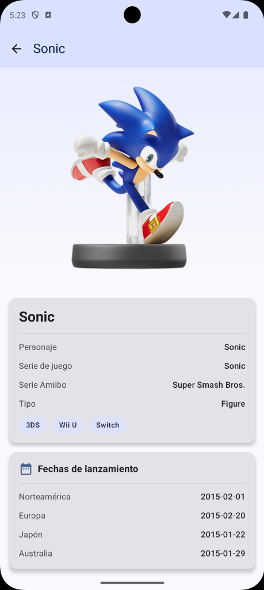

<!-- _class: lead -->
# Module 3: Architecture & Persistence
## MVVM, Room, Retrofit & Coil
### Adrián Catalán
### adriancatalan@galileo.edu

---

# Agenda

1. **Module App**
2. **MVVM & Advanced Architecture**
3. **Room Database**
4. **Networking**
5. **Deep Dive (Internals)**
6. **Challenge Lab**

---

## Amiibo Vault App

This application demonstrates an **Offline-First** architecture. It fetches Amiibo data, stores it locally, and displays it even without an internet connection.

| Home Screen | Detail Screen |
|:-----------:|:-------------:|
|  |  |

---

<!-- _class: lead -->
# 2. Advanced Architecture
## Unidirectional Data Flow (UDF) & State

---

## The "Fragile" UI Problem

**Traditional Android (View System / Early Compose):**
- UI components manage their own state.
- Data is scattered: `isLoading` in Activity, `data` in Adapter, `error` in a Toast.
- **Race conditions**: What if `isLoading` is true but `error` is also not null?

**Consequence:**
- Inconsistent UI states.
- Hard to debug.
- Difficult to test.

---

## The Solution: Unidirectional Data Flow

**Core Principle:** State flows **DOWN**, Events flow **UP**.

```text
    +-----------------------+
    |      UI Layer         |  <-- Renders State
    | (Activity / Composable)|  --> Emits Events
    +-----------------------+
          ^          |
    State |          | Events (Clicks)
          |          v
    +-----------------------+
    |   Presentation Layer  |  <-- Process Events
    |      (ViewModel)      |  --> Updates State
    +-----------------------+
          ^          |
    Data  |          | Calls
          |          v
    +-----------------------+
    |      Data Layer       |  <-- Single Source of Truth
    | (Repository / Source) |
    +-----------------------+
```

---

## UiState Pattern: The Golden Rule

**Rule:** The UI state should be a single, immutable snapshot of the screen at a specific point in time.

**Why Sealed Interfaces?**
- **Exhaustiveness**: The compiler forces you to handle ALL states.
- **Readability**: You see all possible UI configurations in one place.
- **Type Safety**: `Success` state guarantees data is present.

---

## Live Code: Defining UiState

**Bad Approach:**
```kotlin
class MyViewModel : ViewModel() {
    val isLoading = MutableStateFlow(false)
    val data = MutableStateFlow<String?>(null)
    val error = MutableStateFlow<String?>(null)
}
// Possible invalid state: isLoading=true AND data="Wait what?"
```

**Good Approach (Sealed Interface):**
```kotlin
sealed interface AmiiboUiState {
    data object Loading : AmiiboUiState
    data class Success(val amiibos: List<Amiibo>) : AmiiboUiState
    data class Error(val message: String) : AmiiboUiState
}
```

---

## StateFlow vs SharedFlow vs LiveData

**LiveData:**
- **Legacy** (Avoid in new Kotlin projects).
- Tied to Main Thread explicitly.

**StateFlow:**
- **State holder**. Always has a value (requires `initialValue`).
- **Hot stream**: Active only when collected? No, always holds value.
- Replaces LiveData for **UI State**.

**SharedFlow:**
- **Event stream**. Can have 0 subscribers.
- No initial value.
- Drop older events if buffer full.
- **Use for One-off Events** (Navigation, Snackbars).

---

## How to Expose State Safely

Always expose `StateFlow` as read-only.

```kotlin
class AmiiboViewModel : ViewModel() {
    
    // 1. Private Mutable State
    private val _uiState = MutableStateFlow<AmiiboUiState>(AmiiboUiState.Loading)
    
    // 2. Public Immutable State
    val uiState = _uiState.asStateFlow()
    
    fun loadData() {
        _uiState.update { AmiiboUiState.Loading } 
        // .update is atomic and thread-safe!
    }
}
```

---

## MVI vs MVVM (Nuance)

**MVVM (Model-View-ViewModel):**
- Focus on state binding.
- ViewModel exposes multiple observables.

**MVI (Model-View-Intent):**
- Strict single state object.
- **Intents** (Actions) are objects too.

**Modern Android approach:**
- It is a hybrid.
- We use **ViewModel** (MVVM) but with **Single State** (MVI-ish).
- We conceptually treat user actions as "Events" processed by the ViewModel.

---

## Collecting State in Compose

**The naive way (Don't do this):**
```kotlin
val state by viewModel.uiState.collectAsState() 
// KEEPS collecting even when app is in background! 
// Wastes resources/battery.
```

**The safe way:**
```kotlin
// Needs: implementation("androidx.lifecycle:lifecycle-runtime-compose:...")
val state by viewModel.uiState.collectAsStateWithLifecycle()
```
- Automatically stops collecting when the Activity goes to `STOPPED`.
- Restarts when `STARTED`.

---

## Error Handling Strategies in MVVM

Where do we catch exceptions?

1.  **Repository?**
    - Returns `Result<T>`.
    - Pros: Explicit failures in signature.
    - Cons: Wrapper hell `Result<List<Result<Amiibo>>>`.

2.  **ViewModel? (Preferred)**
    - Repository throws exceptions (suspend functions).
    - ViewModel wraps calls in `try-catch`.
    - Maps `Exception` -> `UiState.Error`.

---

## Visualizing the Error Flow

```text
[Repository]
   |  fun getAmiibos() {
   |     throw IOException("No Internet")
   |  }
   v
[ViewModel]
   |  viewModelScope.launch {
   |     try {
   |        repo.getAmiibos()
   |     } catch (e: IOException) {
   |        _uiState.value = Error("Check Connection")
   |     }
   |  }
   v
[UI Layer]
   |  when(state) {
   |      is Error -> ShowSnackbar(state.message)
   |  }
```

---

<!-- _class: lead -->
# 3. Room Database
## Persistence & Offline-First

---

## Why Room?

**Room** is an abstraction layer over SQLite.

**Features:**
- Compile-time verification of SQL queries.
- Built-in migration support.
- Streamlined database access.
- **Observable queries** (Return `Flow<T>`).

It is the standard for localized persistence in Android.

---

## Entity Definition

Data classes marked with `@Entity`.

```kotlin
@Entity(tableName = "amiibos")
data class AmiiboEntity(
    @PrimaryKey
    val id: String, // String ID from API
    
    @ColumnInfo(name = "full_name") 
    val name: String,
    
    val gameSeries: String,
    
    // Room ignores this field
    @Ignore 
    val temporaryFlag: Boolean = false
)
```

---

## DAO (Data Access Object)

The interface to access the DB.

```kotlin
@Dao
interface AmiiboDao {
    
    // 1. Observable Read (Reactive)
    @Query("SELECT * FROM amiibos")
    fun getAll(): Flow<List<AmiiboEntity>>
    
    // 2. One-shot Write (Suspend)
    @Insert(onConflict = OnConflictStrategy.REPLACE)
    suspend fun insertAll(list: List<AmiiboEntity>)
    
    // 3. Transactions
    @Transaction
    suspend fun clearAndInsert(list: List<AmiiboEntity>) {
        deleteAll()
        insertAll(list)
    }
}
```

---

## Type Converters

SQLite only supports primitive types (Text, Int, Real, Blob). 
What if I want to save a `Date` or `List<String>`?

```kotlin
class Converters {
    @TypeConverter
    fun fromTimestamp(value: Long?): Date? {
        return value?.let { Date(it) }
    }

    @TypeConverter
    fun dateToTimestamp(date: Date?): Long? {
        return date?.time
    }
}
```
Register them in `@Database(entities = [...], version = 1)`.

---

## Database Migrations (The Horror)

When you change the schema (add a column), the app crashes on update if you don't migrate.

**Automated Migrations (New & Easy):**
```kotlin
@Database(
    version = 2,
    entities = [AmiiboEntity::class],
    autoMigrations = [
        AutoMigration (from = 1, to = 2)
    ]
)
abstract class AppDatabase : RoomDatabase()
```
Room calculates the diff and generates the SQL script.

---

## Manual Migrations

For complex changes (renaming columns, changing data types).

```kotlin
val MIGRATION_1_2 = object : Migration(1, 2) {
    override fun migrate(database: SupportSQLiteDatabase) {
        database.execSQL(
            "ALTER TABLE amiibos ADD COLUMN is_favorite INTEGER NOT NULL DEFAULT 0"
        )
    }
}
```
Add to builder: `.addMigrations(MIGRATION_1_2)`

---

## Testing DAOs

DAOs should be tested with an in-memory database (fast, no file IO).

```kotlin
@Test
fun writeUserAndReadInList() = runTest {
    val amiibo = AmiiboEntity("1", "Mario")
    dao.insert(amiibo)
    
    val byName = dao.findByName("Mario")
    assertEquals(amiibo, byName)
}
```

---

## Offline-First Strategy

**Repository Logic:**
1.  **Always** emit data from Local DB first (`dao.getAll()`).
2.  Trigger a network refresh in the background.
3.  On network success, write to DB.
4.  DB emits new data automatically.

**Benefits:**
- App works immediately on launch.
- No loading spinners for cached content.
- Network errors don't wipe out the screen.

---

## Visualization: Offline Repo

```text
       [View] <---(Observe)--- [ViewModel] <---(Observe)---- [Repository]
                                                                 ^
                                                                 | 1. Query Flow
                                                                 |
                                                          [Room Database]
                                                                 ^
                                                                 | 3. Insert/Update
          [Network Refresh] -------------------------------------+
                 |
                 v
             [Retrofit] ---> [Internet]
```

---

<!-- _class: lead -->
# 4. Networking
## Retrofit, OkHttp & Coil

---

## Retrofit Essentials

Turns an HTTP API into a Kotlin interface.

```kotlin
interface ApiService {
    @GET("amiibo")
    suspend fun getAmiibos(
        @Query("type") type: String
    ): AmiiboResponse
}
```

**Key concept:** Retrofit uses **Dynamic Proxies** to generate the implementation code at runtime.

---

## JSON Parsing (Serialization)

**Kotlinx Serialization** is the modern standard (Kotlin-first, no reflection).

```kotlin
@Serializable
data class AmiiboDto(
    @SerialName("name") val characterName: String,
    val image: String
)
```

**vs Gson:**
- Gson is maintained by Google but "in maintenance mode".
- Gson uses reflection (slower).
- Kotlinx Serialization is typesafe (fails fast if non-nullable field is missing).

---

## OkHttp: The Engine

Retrofit is just a wrapper. **OkHttp** does the actual work.

**Interceptors:** Hooks into the request/response chain.

1.  **Logging Interceptor:** View JSON in Logcat.
2.  **Auth Interceptor:** Add `Authorization: Bearer xyz` header efficiently.
3.  **Cache Interceptor:** Force HTTP caching.

---

## Visualizing Interceptors

```text
    Request  --> [ Auth Interceptor ] --> (Add Header)
             --> [ Log  Interceptor ] --> (Print Request)
             --> [ Network Call     ] --> INTERNET
                                              |
    Response <-- [ Log  Interceptor ] <-- (Print Response)
             <-- [ ErrorInterceptor ] <-- (Catch 401/500)
             <-- Application
```

---

## Implementing a Header Interceptor

```kotlin
val authInterceptor = Interceptor { chain ->
    val originalRequest = chain.request()
    
    val newRequest = originalRequest.newBuilder()
        .header("Authorization", "Bearer $myToken")
        .header("User-Agent", "AmiiboApp/1.0")
        .build()
        
    chain.proceed(newRequest)
}
```
Plug it in: `OkHttpClient.Builder().addInterceptor(authInterceptor).build()`

---

## Coil: Coroutine Image Loader

Designed for Compose.

**Why Coil?**
- **Memory Caching**: Bitmaps are heavy. Coil reuses memory.
- **Disk Caching**: Saves downloads to local storage.
- **Downsampling**: Loads a small version of the image if the View is small.

```kotlin
AsyncImage(
    model = ImageRequest.Builder(LocalContext.current)
        .data("https://example.com/image.png")
        .crossfade(true)
        .build(),
    contentDescription = null
)
```

---

## Repository Pattern: Mapping

**The Boundary:**
- API returns `AmiiboDto` (Network Model).
- UI wants `Amiibo` (Domain Model).

**Why map?**
- Decouples backend changes from UI logic.
- Format dates, capitalize strings, filter nulls in the mapping layer.

```kotlin
fun AmiiboDto.toDomain(): Amiibo {
    return Amiibo(
        name = this.name.uppercase(),
        imageUrl = this.image ?: "placeholder.png"
    )
}
```

---

<!-- _class: lead -->
# 5. Deep Dive
## Architecture, Room & Network Internals

---

## Architecture: Compose Stability

Why does Compose sometimes recompose too much?

**Unstable Types:** `List`, `Var`, Classes from external modules without Stable marker.
**Stable Types:** `String`, `Int`, Data classes with `val` of Stable types.

**The Fix:**
Wrapper classes or `@Stable` annotation.

```kotlin
@Immutable
data class AmiiboListState(
    val items: List<Amiibo> // List is unstable interface, but @Immutable forces it
)
```
**Takeaway:** Always use `Immutable` / `Stable` for UI State to enable Skippability.

---

## Room: Invalidation Tracker

How does `Flow<List<User>>` update automatically?

1.  Room sets up a standard SQLite `Trigger` (or uses FileObserver in newer versions).
2.  When `INSERT/UPDATE` happens, the Trigger modifies a tracking table `room_table_modification_log`.
3.  Room's `InvalidationTracker` observes this.
4.  If the table you are querying changed, it re-runs the SELECT query.

**Performance Note:** It re-runs the **ENTIRE** query. It receives a new List. Compose creates new items.

---

## Network: Connection Pooling (OkHttp)

Why is the first request slow and subsequent ones fast?

**TCP Handshake (SYN, SYN-ACK, ACK) + TLS Handshake** takes time.

**Connection Pooling:**
OkHttp keeps the socket open for ~5 mins (Keep-Alive).
If you request the same host again, it reuses the socket.

**GZIP Compression:**
OkHttp automatically adds `Accept-Encoding: gzip`.
It transparently unzips the response body.
This can reduce payload size by 70-90%.

---

## ViewModel Lifecycle & SavedStateHandle

**How long does a ViewModel live?**
*   Survives configuration changes (rotation).
*   Destroyed when the Activity/Fragment is **finished** (not just stopped).

**SavedStateHandle:**
For data that must survive **process death** (system kills app in background).

```kotlin
class AmiiboViewModel(
    private val savedStateHandle: SavedStateHandle
) : ViewModel() {
    // Survives process death
    var searchQuery: String
        get() = savedStateHandle["query"] ?: ""
        set(value) { savedStateHandle["query"] = value }
}
```

---

## Repository Pattern Best Practices

**Single Responsibility:**
*   Repository should only coordinate data sources.
*   Don't put business logic here (use Use Cases/Interactors for that).

**Error Mapping:**
```kotlin
// Map network errors to domain errors
suspend fun getAmiibos(): Result<List<Amiibo>> {
    return try {
        Result.success(api.getAmiibos().toDomain())
    } catch (e: IOException) {
        Result.failure(NetworkError("No connection"))
    } catch (e: HttpException) {
        Result.failure(ServerError(e.code()))
    }
}
```

---

<!-- _class: lead -->
# 6. Challenge Lab
## Practice & Application

---

## Part 1: Graceful Offline Mode

**Context:**
Currently, when the API fails, the app shows a full-screen error even if cached data exists in Room. This is poor UX for an offline-first app.

**Your Task:**
Implement graceful error handling that:
- Shows cached data when available, even during errors
- Displays a non-blocking Snackbar for network errors
- Only shows full-screen error when NO cached data exists
- Allows retry without losing current view

**Files to Modify:**
- `ui/viewmodel/AmiiboViewModel.kt`
- `ui/screens/AmiiboListScreen.kt`

---

## Part 1: Definition of Done

| Criteria | Description |
|----------|-------------|
| UiState updated | `Error` state accepts optional `data: List<Amiibo>?` |
| Cached data preserved | Error state carries existing data from previous state |
| Snackbar shown | Network error shows Snackbar, not full-screen error |
| Grid still visible | User sees cached Amiibos while Snackbar is displayed |
| Full error only when empty | Full-screen error only if `data` is null/empty |
| Retry available | Snackbar has "Retry" action button |
| Dismiss works | Snackbar can be dismissed without affecting grid |

---

## Part 2: Local Search

**Context:**
Users want to filter the Amiibo collection by name without making network requests. This requires reactive Flow switching.

**Your Task:**
Implement local search that:
- Adds a search TextField at the top of the screen
- Filters Amiibos in real-time as user types
- Uses Room query (not in-memory filtering)
- Switches between full list and filtered list reactively

**Files to Modify:**
- `data/dao/AmiiboDao.kt`
- `repository/AmiiboRepository.kt`
- `ui/viewmodel/AmiiboViewModel.kt`
- `ui/screens/AmiiboListScreen.kt`

---

## Part 2: Definition of Done

| Criteria | Description |
|----------|-------------|
| DAO method exists | `searchAmiibos(query: String): Flow<List<AmiiboEntity>>` |
| LIKE query works | SQL uses `WHERE name LIKE '%' || :query || '%'` |
| Search TextField | `OutlinedTextField` at top of screen |
| Real-time filtering | Results update as user types (debounce optional) |
| Flow switching | Uses `flatMapLatest` to switch between flows |
| Empty query = all | Blank search shows full list |
| Clear button | X icon to clear search text |

---

<!-- _class: lead -->
# Resources & Wrap-up

---

## Resources

**Architecture & State**
*   [Android Architecture Guide](https://developer.android.com/topic/architecture)
*   [StateFlow and SharedFlow](https://developer.android.com/kotlin/flow/stateflow-and-sharedflow)
*   [Sealed Classes in Kotlin](https://kotlinlang.org/docs/sealed-classes.html)
*   [UI State in Compose](https://developer.android.com/develop/ui/compose/state)
*   [Codelab: State in Jetpack Compose](https://developer.android.com/codelabs/jetpack-compose-state)

**Room Database**
*   [Room Training](https://developer.android.com/training/data-storage/room)
*   [Room with Kotlin Flows](https://developer.android.com/topic/libraries/architecture/room)
*   [Room Migrations Guide](https://developer.android.com/training/data-storage/room/migrating-db-versions)
*   [KSP Overview](https://developer.android.com/build/migrate-to-ksp)
*   [Codelab: Room with a View](https://developer.android.com/codelabs/android-room-with-a-view-kotlin)

**Networking & Images**
*   [Retrofit Documentation](https://square.github.io/retrofit/)
*   [OkHttp Interceptors](https://square.github.io/okhttp/features/interceptors/)
*   [Kotlinx Serialization](https://kotlinlang.org/docs/serialization.html)
*   [Coil for Compose](https://coil-kt.github.io/coil/compose/)
*   [Amiibo API](https://www.amiiboapi.com/)

---

## Recommended Articles

**Room Database**
*   [7 Pro-Tips for Room](https://medium.com/androiddevelopers/7-pro-tips-for-room-fbadea4bfbd1) - Android Developers
*   [Room Flow: Reactive Queries](https://medium.com/androiddevelopers/room-flow-273acffe5b57) - Android Developers
*   [Database Relations in Room](https://proandroiddev.com/android-room-handling-relations-using-livedata-2d892e40bd53) - ProAndroidDev

**Offline-First Architecture**
*   [Build an Offline-First App](https://proandroiddev.com/build-an-offline-first-app-with-room-and-coroutines-e1f8a65e0a71) - ProAndroidDev
*   [Caching Strategies for Android](https://medium.com/androiddevelopers/caching-strategies-f7b2f6c3e4b8) - Android Developers
*   [The Repository Pattern Explained](https://proandroiddev.com/the-repository-pattern-in-android-30bc1d80c13d) - ProAndroidDev
