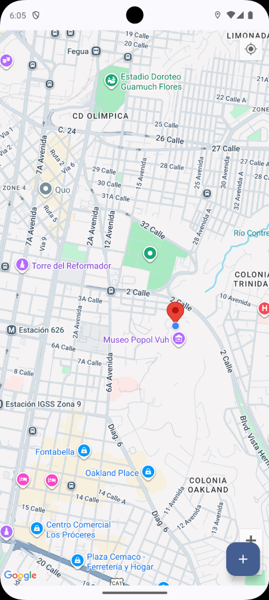
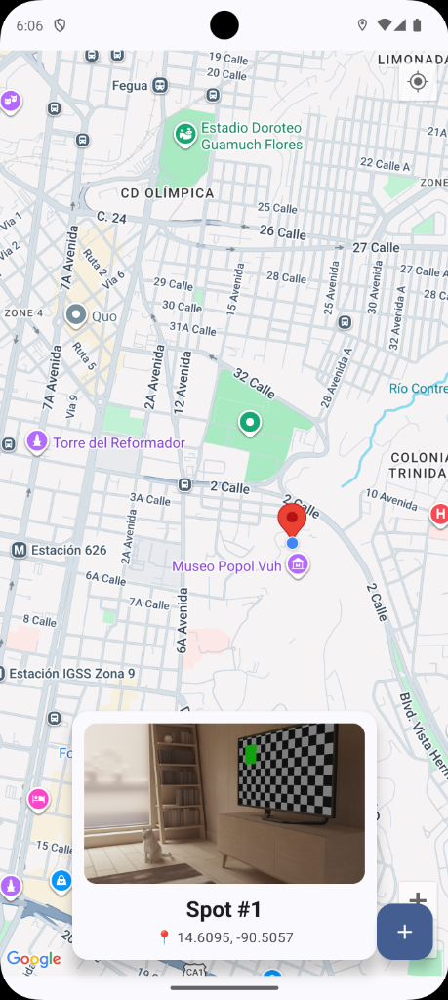

<!-- _class: lead -->
# Module 4: Hardware & Location
## Repository Pattern, CameraX & Google Maps
### Adrián Catalán
### adriancatalan@galileo.edu

---

# Agenda

1. **Module App**
2. **Repository Pattern**
3. **CameraX**
4. **Google Maps SDK**
5. **Deep Dive**
6. **Challenge Lab**

---

## City Spots App

An app that captures **geolocated photos** and displays them on an interactive map.

| Map Screen | Detail Screen |
|:----------:|:-------------:|
|  |  |

---

## What We're Building

**Features:**
1. **Capture Photos**: Use CameraX to take pictures
2. **Get Location**: FusedLocationProvider for GPS coordinates
3. **Store Locally**: Room database for persistence
4. **Visualize on Map**: Google Maps with custom markers

**Architecture Challenge:**
How do we coordinate Camera + GPS + Database without creating spaghetti code?

---

<!-- _class: lead -->
# 2. Repository Pattern
## Unifying Multiple Data Sources

---

## The Problem: Spaghetti Code

**Without Repository:**
The ViewModel talks to *everything* directly.

```text
┌───────────────────────────────────────────────────────────┐
│                          ViewModel                        │
│                                                           │
│   ┌──────────┐    ┌──────────┐    ┌──────────┐            │
│   │ CameraX  │    │   GPS    │    │   Room   │            │
│   └──────────┘    └──────────┘    └──────────┘            │
│        │               │               │                  │
│        ▼               ▼               ▼                  │
│   Knows camera    Knows location   Knows SQL              │
│   lifecycle       permissions      queries                │
└───────────────────────────────────────────────────────────┘
```

**Result:** ViewModel becomes a "God Class" with 500+ lines.

---

## The Solution: Single Point of Access

**With Repository:**
The ViewModel only knows about *one* interface.

```text
┌─────────────────────────────────────────────────────────────────┐
│                          ViewModel                              │
│                    "I need to create a Spot"                    │
│                              │                                  │
│                              ▼                                  │
│                      ┌─────────────┐                            │
│                      │ Repository  │ <-- Single Source of Truth │
│                      └─────────────┘                            │
│                     /       │       \                           │
│                    ▼        ▼        ▼                          │
│              [CameraX]   [GPS]    [Room]                        │
└─────────────────────────────────────────────────────────────────┘
```

**Result:** ViewModel is simple. Repository handles coordination.

---

## Real World Analogy: The Concierge

**Problem (No Repository):**
You're a tourist. You need:
- A taxi (Camera)
- A restaurant reservation (GPS)
- A theater ticket (Database)

You call each service separately, handle each error, coordinate timing...
*Exhausting.*

---

## Real World Analogy: The Solution

**Solution (Repository = Hotel Concierge):**
You tell the Concierge: "I want dinner and a show tonight."

The Concierge:
1. Calls the restaurant
2. Books the theater
3. Arranges the taxi timing
4. Returns ONE answer: "You're all set for 7pm"

You don't care *how* it was done. The Concierge is your **Single Point of Access**.

---

## Live Code: SpotRepository

```kotlin
//repository/SpotRepository.kt
class SpotRepository(
    private val spotDao: SpotDao,           // Database
    private val cameraUtils: CameraUtils,   // Camera hardware
    private val locationUtils: LocationUtils, // GPS
    private val coordinateValidator: CoordinateValidator
) {
    // Database operations
    fun getAllSpots(): Flow<List<SpotEntity>> = spotDao.getAllSpots()

    // Hardware operations
    suspend fun capturePhoto(imageCapture: ImageCapture): Uri =
        cameraUtils.capturePhoto(imageCapture)

    // Location operations
    suspend fun getCurrentLocation(): Location? =
        locationUtils.getCurrentLocation()
}
```

---

## Orchestration: The Real Power

The Repository **coordinates** multiple sources into one operation:

```kotlin
suspend fun createSpot(imageCapture: ImageCapture): CreateSpotResult {
    // 1. Capture photo from camera
    val photoUri = capturePhoto(imageCapture)

    // 2. Get GPS coordinates
    val location = getCurrentLocation()
        ?: return CreateSpotResult.NoLocation

    // 3. Validate coordinates (Null Island check)
    val validation = coordinateValidator.validate(
        latitude = location.latitude,
        longitude = location.longitude
    )
    if (validation !is ValidationResult.Valid) {
        return CreateSpotResult.InvalidCoordinates(validation.message)
    }

    // 4. Save to database
    val spot = SpotEntity(imageUri = photoUri.toString(), ...)
    val id = spotDao.insertSpot(spot)

    return CreateSpotResult.Success(spot.copy(id = id))
}
```

---

## Result Types: Explicit Error Handling

Instead of throwing exceptions, we return typed results:

```kotlin
sealed class CreateSpotResult {
    data class Success(val spot: SpotEntity) : CreateSpotResult()
    data object NoLocation : CreateSpotResult()
    data class InvalidCoordinates(val message: String) : CreateSpotResult()
}
```

**Benefits:**
- Compiler forces handling all cases
- UI can show specific error messages
- No try-catch spaghetti in ViewModel

---

## Consuming in ViewModel

```kotlin
//ui/viewmodel/MapViewModel.kt
fun captureSpot(imageCapture: ImageCapture) {
    viewModelScope.launch {
        _isLoading.value = true

        when (val result = repository.createSpot(imageCapture)) {
            is CreateSpotResult.Success -> {
                _message.value = "Spot saved: ${result.spot.title}"
            }
            is CreateSpotResult.NoLocation -> {
                _errorMessage.value = "Could not get GPS location"
            }
            is CreateSpotResult.InvalidCoordinates -> {
                _errorMessage.value = result.message
            }
        }

        _isLoading.value = false
    }
}
```

---

## Dependency Injection Setup

```kotlin
//di/AppModule.kt
val appModule = module {
    // Singletons for utilities
    single { CameraUtils(androidContext()) }
    single { LocationUtils(androidContext()) }
    singleOf(::CoordinateValidator)

    // Database
    single { SpotDatabase.getInstance(androidContext()) }
    single { get<SpotDatabase>().spotDao() }

    // Repository receives all dependencies
    single {
        SpotRepository(
            spotDao = get(),
            cameraUtils = get(),
            locationUtils = get(),
            coordinateValidator = get()
        )
    }

    viewModelOf(::MapViewModel)
}
```

---

<!-- _class: lead -->
# 3. CameraX
## Modern Camera API for Android

---

## Why CameraX?

**The Old Way (Camera2 API):**
- 1000+ lines of boilerplate
- Manual lifecycle management
- Device-specific bugs
- Complex threading model

**The New Way (CameraX):**
- ~50 lines for basic capture
- Automatic lifecycle binding
- Google handles device quirks
- Coroutines-friendly

---

## CameraX Architecture: Use Cases

CameraX uses a **Use Case** pattern. You declare *what* you want, not *how*.

```text
┌─────────────────────────────────────────────────────────────────┐
│                     CameraX Use Cases                           │
├─────────────────────────────────────────────────────────────────┤
│                                                                 │
│  ┌──────────┐  ┌──────────────┐  ┌──────────────┐               │
│  │ Preview  │  │ ImageCapture │  │ VideoCapture │               │
│  │          │  │              │  │              │               │
│  │ Show     │  │ Take still   │  │ Record       │               │
│  │ viewfind │  │ photos       │  │ videos       │               │
│  └──────────┘  └──────────────┘  └──────────────┘               │
│                                                                 │
│                  ┌───────────────┐                              │
│                  │ ImageAnalysis │                              │
│                  │               │                              │
│                  │ Real-time     │                              │
│                  │ ML/QR scan    │                              │
│                  └───────────────┘                              │
└─────────────────────────────────────────────────────────────────┘
```

---

## Live Code: ImageCapture Setup

```kotlin
//ui/screens/CameraScreen.kt
@Composable
fun CameraScreen(onPhotoTaken: (Uri) -> Unit) {
    val context = LocalContext.current
    val lifecycleOwner = LocalLifecycleOwner.current

    // 1. Create ImageCapture Use Case
    val imageCapture = remember {
        ImageCapture.Builder()
            .setCaptureMode(ImageCapture.CAPTURE_MODE_MAXIMIZE_QUALITY)
            .build()
    }

    // 2. Display Camera Preview
    CameraPreview(
        imageCapture = imageCapture,
        lifecycleOwner = lifecycleOwner
    )

    // 3. Capture Button
    Button(onClick = { /* trigger capture */ }) {
        Text("Take Photo")
    }
}
```

---

## AndroidView: Bridging Compose and Views

CameraX's `PreviewView` is a traditional View. We use `AndroidView` to embed it:

```kotlin
@Composable
fun CameraPreview(
    imageCapture: ImageCapture,
    lifecycleOwner: LifecycleOwner
) {
    AndroidView(
        factory = { context ->
            PreviewView(context).apply {
                implementationMode = PreviewView.ImplementationMode.COMPATIBLE
            }
        },
        update = { previewView ->
            val cameraProviderFuture = ProcessCameraProvider.getInstance(context)
            cameraProviderFuture.addListener({
                val cameraProvider = cameraProviderFuture.get()
                bindCameraUseCases(cameraProvider, previewView, imageCapture)
            }, ContextCompat.getMainExecutor(context))
        }
    )
}
```

---

## Binding Use Cases to Lifecycle

```kotlin
private fun bindCameraUseCases(
    cameraProvider: ProcessCameraProvider,
    previewView: PreviewView,
    imageCapture: ImageCapture
) {
    // 1. Build Preview Use Case
    val preview = Preview.Builder().build().also {
        it.setSurfaceProvider(previewView.surfaceProvider)
    }

    // 2. Select Camera
    val cameraSelector = CameraSelector.DEFAULT_BACK_CAMERA

    // 3. Unbind previous and bind new
    cameraProvider.unbindAll()
    cameraProvider.bindToLifecycle(
        lifecycleOwner,
        cameraSelector,
        preview,        // Use Case 1: Preview
        imageCapture    // Use Case 2: Capture
    )
}
```

---

## Callback to Coroutine Conversion

CameraX uses callbacks. We convert to coroutines with `suspendCancellableCoroutine`:

```kotlin
//utils/CameraUtils.kt
suspend fun capturePhoto(imageCapture: ImageCapture): Uri {
    return suspendCancellableCoroutine { continuation ->
        val photoFile = createImageFile()
        val outputOptions = ImageCapture.OutputFileOptions.Builder(photoFile).build()

        imageCapture.takePicture(
            outputOptions,
            ContextCompat.getMainExecutor(context),
            object : ImageCapture.OnImageSavedCallback {
                override fun onImageSaved(output: OutputFileResults) {
                    continuation.resume(Uri.fromFile(photoFile))
                }
                override fun onError(exception: ImageCaptureException) {
                    photoFile.delete()
                    continuation.resumeWithException(exception)
                }
            }
        )

        continuation.invokeOnCancellation { photoFile.delete() }
    }
}
```

---

## File Storage: Internal vs External

```kotlin
fun createImageFile(): File {
    // Internal storage: Private to app, no permissions needed
    val storageDir = context.filesDir

    val timeStamp = SimpleDateFormat("yyyyMMdd_HHmmss", Locale.US).format(Date())
    val fileName = "spot_$timeStamp.jpg"

    return File(storageDir, fileName)
}
```

| Storage Type | Permission | Visible to User | Survives Uninstall |
|--------------|------------|-----------------|-------------------|
| `filesDir` (Internal) | None | No | No |
| `getExternalFilesDir` | None (API 19+) | Yes | No |
| MediaStore | READ/WRITE | Yes | Yes |

---

## Runtime Permissions (Accompanist)

```kotlin
@Composable
fun CameraPermissionWrapper(content: @Composable () -> Unit) {
    val cameraPermissionState = rememberPermissionState(
        Manifest.permission.CAMERA
    )

    when {
        cameraPermissionState.status.isGranted -> {
            content() // Show camera
        }
        cameraPermissionState.status.shouldShowRationale -> {
            RationaleDialog(
                onConfirm = { cameraPermissionState.launchPermissionRequest() }
            )
        }
        else -> {
            Button(onClick = { cameraPermissionState.launchPermissionRequest() }) {
                Text("Grant Camera Permission")
            }
        }
    }
}
```

---

<!-- _class: lead -->
# 4. Google Maps SDK
## Interactive Maps in Compose

---

## Maps Compose: Declarative Mapping

Instead of imperative `googleMap.addMarker(...)`, we declare:

```kotlin
GoogleMap(
    cameraPositionState = cameraPositionState
) {
    // Markers are Composables!
    Marker(
        state = rememberMarkerState(position = LatLng(14.6, -90.5)),
        title = "Guatemala City"
    )
}
```

**Key Concept:** The map is *part* of the Compose tree. State changes trigger recomposition, and markers update automatically.

---

## Live Code: MapScreen

```kotlin
//ui/screens/MapScreen.kt
@Composable
fun MapScreen(
    viewModel: MapViewModel = koinViewModel(),
    onNavigateToCamera: () -> Unit
) {
    val spots by viewModel.spots.collectAsState()
    val userLocation by viewModel.userLocation.collectAsState()

    val cameraPositionState = rememberCameraPositionState {
        position = userLocation?.let {
            CameraPosition.fromLatLngZoom(it, 15f)
        } ?: CameraPosition.fromLatLngZoom(LatLng(0.0, 0.0), 2f)
    }

    Box(modifier = Modifier.fillMaxSize()) {
        GoogleMap(
            cameraPositionState = cameraPositionState,
            properties = MapProperties(isMyLocationEnabled = true)
        ) {
            spots.forEach { spot -> SpotMarker(spot) }
        }

        // FAB to open camera
        FloatingActionButton(onClick = onNavigateToCamera) {
            Icon(Icons.Filled.Add, "Add Spot")
        }
    }
}
```

---

## Custom Info Windows

```kotlin
@Composable
private fun SpotMarker(spot: SpotEntity) {
    MarkerInfoWindowContent(
        state = rememberMarkerState(
            position = LatLng(spot.latitude, spot.longitude)
        ),
        title = spot.title
    ) {
        // Custom Composable as Info Window
        Column(
            modifier = Modifier
                .background(Color.White, RoundedCornerShape(12.dp))
                .padding(8.dp)
        ) {
            AsyncImage(
                model = spot.imageUri.toUri(),
                contentDescription = spot.title,
                modifier = Modifier.size(180.dp, 120.dp)
            )
            Text(text = spot.title, style = MaterialTheme.typography.titleMedium)
            Text(
                text = "📍 ${spot.latitude}, ${spot.longitude}",
                style = MaterialTheme.typography.bodySmall
            )
        }
    }
}
```

---

## FusedLocationProvider: Getting GPS

```kotlin
//utils/LocationUtils.kt
class LocationUtils(context: Context) {
    private val fusedLocationClient =
        LocationServices.getFusedLocationProviderClient(context)

    @SuppressLint("MissingPermission")
    suspend fun getCurrentLocation(): Location? {
        return suspendCancellableCoroutine { continuation ->
            val request = CurrentLocationRequest.Builder()
                .setPriority(Priority.PRIORITY_HIGH_ACCURACY)
                .setMaxUpdateAgeMillis(10_000) // Accept 10s old location
                .build()

            fusedLocationClient.getCurrentLocation(request, null)
                .addOnSuccessListener { location ->
                    continuation.resume(location)
                }
                .addOnFailureListener { exception ->
                    continuation.resumeWithException(exception)
                }
        }
    }
}
```

---

## Priority Levels Explained

| Priority | Accuracy | Battery | Use Case |
|----------|----------|---------|----------|
| `HIGH_ACCURACY` | ~10m | High | Navigation, Photo geotagging |
| `BALANCED_POWER_ACCURACY` | ~100m | Medium | City-level apps |
| `LOW_POWER` | ~1km | Low | Background tracking |
| `PASSIVE` | Varies | None | Opportunistic updates |

```kotlin
// For photo geotagging, we want high accuracy
.setPriority(Priority.PRIORITY_HIGH_ACCURACY)
```

---

## Coordinate Validation: Null Island

**Problem:** GPS can return (0.0, 0.0) as an error state.

```kotlin
//utils/CoordinateValidator.kt
fun validate(latitude: Double, longitude: Double): ValidationResult {
    // Check for NaN/Infinity
    if (latitude.isNaN() || longitude.isNaN()) {
        return ValidationResult.NotANumber
    }

    // Latitude: -90 to +90
    if (latitude < -90.0 || latitude > 90.0) {
        return ValidationResult.InvalidLatitude(latitude)
    }

    // Longitude: -180 to +180
    if (longitude < -180.0 || longitude > 180.0) {
        return ValidationResult.InvalidLongitude(longitude)
    }

    // "Null Island" check (0,0 is suspicious)
    if (latitude == 0.0 && longitude == 0.0) {
        return ValidationResult.SuspiciousNullIsland
    }

    return ValidationResult.Valid
}
```

---

## API Key Configuration

**Step 1: local.properties (NEVER commit!)**
```properties
MAPS_API_KEY=AIzaSy...your_key_here
```

**Step 2: build.gradle.kts**
```kotlin
val localProperties = Properties()
localProperties.load(rootProject.file("local.properties").inputStream())

android {
    defaultConfig {
        manifestPlaceholders["MAPS_API_KEY"] =
            localProperties.getProperty("MAPS_API_KEY") ?: ""
    }
}
```

---

**Step 3: AndroidManifest.xml**
```xml
<meta-data
    android:name="com.google.android.geo.API_KEY"
    android:value="${MAPS_API_KEY}" />
```

---

## ViewModel: Reactive Map State

```kotlin
//ui/viewmodel/MapViewModel.kt
class MapViewModel(private val repository: SpotRepository) : ViewModel() {

    private val _userLocation = MutableStateFlow<LatLng?>(null)
    val userLocation = _userLocation.asStateFlow()

    // Flow from Room, converted to StateFlow
    val spots: StateFlow<List<SpotEntity>> = repository.getAllSpots()
        .stateIn(
            scope = viewModelScope,
            started = SharingStarted.WhileSubscribed(5000),
            initialValue = emptyList()
        )

    fun loadUserLocation() {
        viewModelScope.launch {
            repository.getCurrentLocation()?.let { location ->
                _userLocation.value = LatLng(location.latitude, location.longitude)
            }
        }
    }
}
```

---

<!-- _class: lead -->
# 5. Deep Dive
## Under the Hood

---

## 1. CameraX: ProcessCameraProvider Lifecycle

**How does CameraX manage camera resources?**

```text
[Activity]           [ProcessCameraProvider]        [Camera Hardware]
    |                         |                            |
    | -- bindToLifecycle ---> |                            |
    |                         | ---- Open Camera --------> |
    |                         |                            |
    | <-- onStart ----------- |                            |
    |                         | ---- Start Preview ------> |
    |                         |                            |
    | <-- onStop ------------ |                            |
    |                         | ---- Stop Preview -------> |
    |                         |                            |
    | <-- onDestroy --------- |                            |
    |                         | ---- Release Camera -----> |
```

CameraX observes the LifecycleOwner and manages camera open/close automatically.

---

## 2. suspendCancellableCoroutine Internals

**How do we convert callbacks to coroutines?**

```kotlin
suspend fun example(): Result = suspendCancellableCoroutine { continuation ->
    // 1. Coroutine is SUSPENDED here

    asyncOperation(
        onSuccess = { result ->
            // 2. Resume the coroutine with result
            continuation.resume(result)
        },
        onError = { error ->
            // 2b. Or resume with exception
            continuation.resumeWithException(error)
        }
    )

    // 3. Handle cancellation
    continuation.invokeOnCancellation {
        // Clean up resources if coroutine is cancelled
        cancelAsyncOperation()
    }
}
```

**Key Rule:** You MUST call `resume` or `resumeWithException` exactly ONCE.

---

## 3. FusedLocationProvider: Sensor Fusion

**How does "Fused" location work?**

```text
┌─────────────────────────────────────────────────────────────────┐
│                    FusedLocationProvider                        │
├─────────────────────────────────────────────────────────────────┤
│                                                                 │
│   ┌─────────┐    ┌─────────┐    ┌─────────┐    ┌─────────┐      │
│   │   GPS   │    │ WiFi AP │    │  Cell   │    │ Sensors │      │
│   │         │    │ Database│    │ Towers  │    │ (Accel) │      │
│   └────┬────┘    └────┬────┘    └────┬────┘    └────┬────┘      │
│        │              │              │              │           │
│        └──────────────┴──────────────┴──────────────┘           │
│                          │                                      │
│                    Kalman Filter                                │
│                          │                                      │
│                    Best Estimate                                │
│                     (Lat, Lng)                                  │
└─────────────────────────────────────────────────────────────────┘
```

It combines multiple signals to get the best accuracy with optimal battery.

---

## 4. Room + Flow: Invalidation Tracker

**How does `Flow<List<Spot>>` update automatically?**

```text
[DAO Query]             [Room]                  [SQLite]
     |                    |                        |
     | -- getAllSpots --> |                        |
     |                    | -- Setup Trigger ----> |
     |                    |                        |
     | <-- Flow<List> --- |                        |
     |                    |                        |
     |         (Some code does INSERT)             |
     |                    |                        |
     |                    | <-- Trigger fires ---- |
     |                    |                        |
     |                    | -- Re-run query -----> |
     |                    |                        |
     | <-- Emit new list- |                        |
```

Room's `InvalidationTracker` listens for table changes and re-queries.

---

## 5. Maps Compose: Interop Architecture

**How does GoogleMap work inside Compose?**

```text
┌─────────────────────────────────────────────────────────────────┐
│                        Compose UI Tree                          │
│                                                                 │
│    ┌────────────────────────────────────────────────────────┐   │
│    │                   GoogleMap Composable                 │   │
│    │                                                        │   │
│    │   ┌────────────────────────────────────────────────┐   │   │
│    │   │              AndroidView                       │   │   │
│    │   │                                                │   │   │
│    │   │   ┌────────────────────────────────────────┐   │   │   │
│    │   │   │            MapView (View)              │   │   │   │
│    │   │   │                                        │   │   │   │
│    │   │   │   ┌────────────────────────────────┐   │   │   │   │
│    │   │   │   │       GoogleMap Object         │   │   │   │   │
│    │   │   │   │       (Native Maps SDK)        │   │   │   │   │
│    │   │   │   └────────────────────────────────┘   │   │   │   │
│    │   │   └────────────────────────────────────────┘   │   │   │
│    │   └────────────────────────────────────────────────┘   │   │
│    └────────────────────────────────────────────────────────┘   │
└─────────────────────────────────────────────────────────────────┘
```

Maps Compose wraps the traditional MapView using AndroidView interop.

---

<!-- _class: lead -->
# 6. Challenge Lab
## Practice & Application

---

## Part 1: Granular Error Handling

**Context:**
The app currently shows generic errors when photo capture fails. Users don't know if the problem is the camera, storage, or permissions.

**Your Task:**
Implement typed error handling for `CameraUtils.capturePhoto()` that distinguishes between:
- Camera was closed unexpectedly
- Capture failed (hardware issue)
- File I/O error (storage full or permissions)

---

**Files to Modify:**
- `utils/CameraUtils.kt`
- `repository/SpotRepository.kt` (CreateSpotResult)
- `ui/screens/CameraScreen.kt`

---

## Part 1: Definition of Done

| Criteria | Description |
|----------|-------------|
| Sealed class exists | `CaptureError` sealed class with 3+ error types |
| Errors are mapped | `ImageCaptureException.imageCaptureError` codes mapped to sealed class |
| Repository updated | `CreateSpotResult` has new `PhotoCaptureFailed` case |
| UI shows specific messages | Each error type displays a different user-friendly message |
| No crashes | App handles all error cases gracefully |

---

## Part 2: Spot Deletion Feature

**Context:**
Users can create spots but cannot delete them. We need to add deletion with proper cleanup.

**Your Task:**
Implement spot deletion that:
- Triggers on long-press of a map marker
- Shows a confirmation dialog before deleting
- Removes the spot from Room database
- Deletes the associated photo file from internal storage

---

**Files to Modify:**
- `data/dao/SpotDao.kt`
- `repository/SpotRepository.kt`
- `ui/screens/MapScreen.kt`
- `ui/viewmodel/MapViewModel.kt`

---

## Part 2: Definition of Done

| Criteria | Description |
|----------|-------------|
| DAO method exists | `deleteSpot(id: Long)` query in SpotDao |
| Repository coordinates | Deletes from DB AND deletes photo file |
| Long-press triggers dialog | Marker info window responds to long-press |
| Confirmation dialog | AlertDialog asks "Are you sure?" before deletion |
| File cleanup | Photo file is deleted from `filesDir` |
| UI updates automatically | Map removes marker after deletion (Flow reactivity) |
| Edge cases handled | Graceful handling if file doesn't exist |

---

<!-- _class: lead -->
# Resources & Wrap-up

---

## Resources

| Repository Pattern | CameraX | Google Maps SDK |
|:-------------------|:--------|:----------------|
| [Guide to App Architecture](https://developer.android.com/topic/architecture) | [CameraX Overview](https://developer.android.com/training/camerax) | [Maps SDK for Android](https://developers.google.com/maps/documentation/android-sdk/overview) |
| [Data Layer Guide](https://developer.android.com/topic/architecture/data-layer) | [CameraX Codelab](https://developer.android.com/codelabs/camerax-getting-started) | [Maps Compose Library](https://developers.google.com/maps/documentation/android-sdk/maps-compose) |
| [Repository Pattern in Android](https://developer.android.com/codelabs/basic-android-kotlin-training-repository-pattern) | [ImageCapture Use Case](https://developer.android.com/training/camerax/take-photo) | [FusedLocationProvider](https://developer.android.com/training/location) |
| [Clean Architecture with MVVM](https://proandroiddev.com/clean-architecture-data-flow-dependency-rule-615f78a0ccbb) | [CameraX Architecture](https://developer.android.com/training/camerax/architecture) | [Location Permissions](https://developer.android.com/training/location/permissions) |
| [Testing Repositories](https://developer.android.com/training/testing/local-tests) | [Camera Permissions Guide](https://developer.android.com/training/permissions/requesting) | [Maps API Key Setup](https://developers.google.com/maps/documentation/android-sdk/get-api-key) |

---

## Recommended Articles

**CameraX**
*   [CameraX: Making Camera Development Easy](https://medium.com/androiddevelopers/camerax-making-camera-development-easy-37ad7d6f4c6d) - Android Developers
*   [Building a Camera App with CameraX](https://proandroiddev.com/building-a-simple-camera-app-with-camerax-8c63d4eef5e2) - ProAndroidDev
*   [Migrating from Camera2 to CameraX](https://medium.com/androiddevelopers/migrating-from-camera2-to-camerax-c09c62a6dff0) - Android Developers

**Maps & Location**
*   [Google Maps Compose Under the Hood](https://medium.com/androiddevelopers/google-maps-compose-under-the-hood-7cfdd676d91d) - Android Developers
*   [Best Practices for Location](https://proandroiddev.com/best-practices-for-location-in-android-46c8b5eb6c00) - ProAndroidDev
*   [Battery-Efficient Location Updates](https://medium.com/androiddevelopers/battery-drain-and-location-e5f55b1a8c4a) - Android Developers
