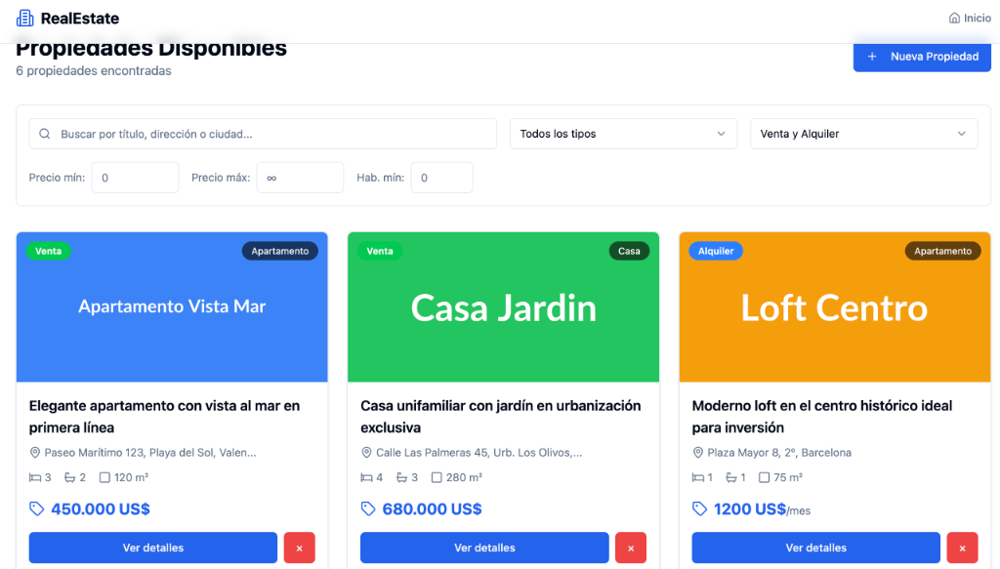
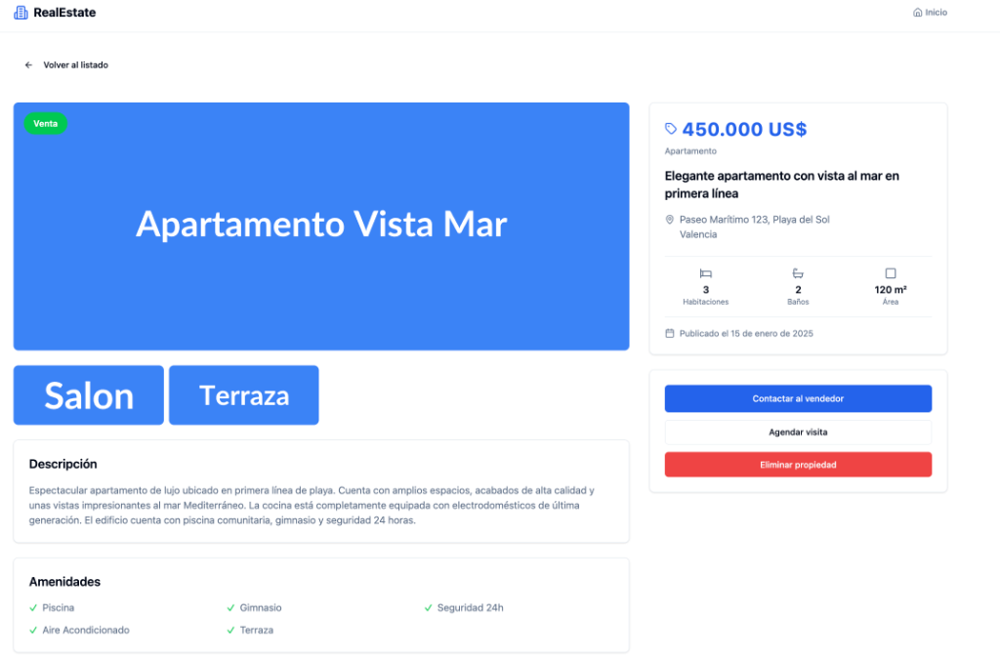

# Módulo 2 - Real Estate React

## Frontend Single Page Application

> Portal inmobiliario con React 19, Zod, React Hook Form, Tailwind CSS y Shadcn UI.

**Deploy:** https://module2-realestate.vercel.app/

---

## Stack Tecnologico

| Dependencia | Version | Propósito |
|-------------|---------|-----------|
| **React** | 19.2.1 | Biblioteca UI Core |
| **Vite** | 6.4.1 | Build tool & Dev Server |
| **Tailwind CSS** | 4.1.8 | Framework de estilos (Motor v4) |
| **Shadcn UI** | Manual | Componentes UI reutilizables |
| **React Hook Form** | 7.54.2 | Gestión de estado de formularios |
| **Zod** | 4.1.9 | Esquemas de validación |
| **Sonner** | 2.0.7 | Sistema de notificaciones (Toasts) |
| **React Router** | 7.1.1 | Enrutamiento cliente |

---

## Descripción del Proyecto

**Real Estate React** es una aplicación web de bienes raíces que permite listar, buscar y gestionar propiedades inmobiliarias. El proyecto implementa las últimas tecnologías frontend disponibles (React 19, Tailwind v4) para ofrecer una experiencia de desarrollo moderna y eficiente.

### Vistas de la Aplicación

#### Listado de Propiedades


#### Detalle de Propiedad


Concepts clave implementados:

1.  **Tailwind CSS v4**: Configuración nativa CSS sin `tailwind.config.js`. Las variables de tema se definen directamente en CSS usando `@theme`.
2.  **Validación Robusta**: Implementación de un *Custom Resolver* manual para conectar Zod con React Hook Form, garantizando independencia de versiones y control total de errores.
3.  **Componentes Shadcn UI**: Arquitectura de componentes "copy-paste" para máxima personalización.
4.  **Estado Local & Persistencia**: Combinación de `useState` para interactividad y `localStorage` para persistencia de datos.

---

## Contexto Pedagógico

Este módulo cubre implementaciones avanzadas de los siguientes conceptos:

### 1. React 19 & Hooks Modernos

Uso de los últimos hooks estables para gestión de estado y efectos:

```tsx
// Gestión eficiente de colecciones
const [properties, setProperties] = useState<Property[]>([]);

// Memorización para optimizar re-renders
const loadProperties = useCallback(() => {
  const filtered = filterProperties(filters);
  setProperties(filtered);
}, [filters]);
```

### 2. Validación Type-Safe con Custom Resolver

En lugar de depender de adaptadores genéricos, implementamos una capa de validación manual que conecta Zod con React Hook Form. Esto nos da control total sobre cómo se procesan y muestran los errores.

```tsx
// Validación segura dentro del componente
resolver: async (values) => {
  try {
    // Validación estricta con Zod
    const result = createPropertySchema.safeParse(values);
    
    if (result.success) {
      return { values: result.data, errors: {} };
    }

    // Mapeo manual de errores para feedback preciso
    const errors = result.error.issues.reduce(/* lógica de mapeo */);
    
    return { values: {}, errors };
  } catch (error) {
    // Manejo de errores críticos
    return { values: {}, errors: { root: { type: 'server', message: 'Error crítico' } } };
  }
}
```

### 3. Shadcn UI y Componentes Reutilizables

```tsx
// Componentes Shadcn importados directamente
import { Button } from '@/components/ui/button';
import { Card, CardContent, CardHeader, CardTitle } from '@/components/ui/card';

// Uso con variantes
<Button variant="destructive" size="lg">Eliminar</Button>
```

### 4. Routing con React Router

```tsx
// Definición de rutas
<Routes>
  <Route path="/" element={<HomePage />} />
  <Route path="/property/:id" element={<PropertyDetailPage />} />
</Routes>

// Navegación programática
const navigate = useNavigate();
navigate('/property/123');

// Parámetros de URL
const { id } = useParams<{ id: string }>();
```

### 5. Persistencia con localStorage

```tsx
// Guardando datos
localStorage.setItem('properties', JSON.stringify(properties));

// Leyendo datos
const data = localStorage.getItem('properties');
const properties = data ? JSON.parse(data) : [];
```

---

## Estructura del Proyecto

```
module2-real-estate/
├── index.html                 # Punto de entrada HTML
├── package.json               # Dependencias
├── tsconfig.json              # Configuración TypeScript
├── vite.config.ts             # Configuración Vite + Tailwind v4
├── eslint.config.js           # Reglas de linting
├── .prettierrc                # Formato de código
├── .gitignore                 # Archivos ignorados
├── README.md                  # Esta documentación
├── TECH_STACK.md              # Versiones de dependencias
└── src/
    ├── main.tsx               # Punto de entrada React
    ├── App.tsx                # Componente raíz con routing
    ├── index.css              # Estilos globales + Shadcn variables
    ├── vite-env.d.ts          # Tipos de Vite
    ├── components/
    │   ├── ui/                # Componentes Shadcn UI
    │   │   ├── button.tsx
    │   │   ├── card.tsx
    │   │   ├── input.tsx
    │   │   ├── label.tsx
    │   │   ├── select.tsx
    │   │   └── textarea.tsx
    │   ├── PropertyCard.tsx   # Tarjeta de propiedad
    │   └── PropertyForm.tsx   # Formulario con validación
    ├── pages/
    │   ├── HomePage.tsx       # Lista con filtros
    │   ├── NewPropertyPage.tsx # Crear propiedad
    │   └── PropertyDetailPage.tsx # Detalle
    ├── lib/
    │   ├── utils.ts           # Utilidades (cn, formatters)
    │   └── storage.ts         # Operaciones localStorage
    ├── types/
    │   └── property.ts        # Tipos y esquemas Zod
    └── data/
        └── sampleProperties.ts # Datos de ejemplo
```

---

## Arquitectura

```
┌─────────────────────────────────────────────────────────────────────────────┐
│                              ARQUITECTURA                                    │
├─────────────────────────────────────────────────────────────────────────────┤
│                                                                              │
│    ┌────────────────────────────────────────────────────────────────────┐   │
│    │                           App.tsx                                   │   │
│    │                    (Router + Layout)                                │   │
│    └────────────────────────────────────────────────────────────────────┘   │
│                                    │                                         │
│          ┌─────────────────────────┼─────────────────────────┐              │
│          ▼                         ▼                         ▼              │
│    ┌───────────┐            ┌───────────┐            ┌───────────┐         │
│    │ HomePage  │            │NewProperty│            │ Property  │         │
│    │           │            │   Page    │            │DetailPage │         │
│    └─────┬─────┘            └─────┬─────┘            └─────┬─────┘         │
│          │                        │                        │                │
│          ▼                        ▼                        │                │
│    ┌───────────┐            ┌───────────┐                  │                │
│    │ Property  │            │ Property  │                  │                │
│    │   Card    │            │   Form    │                  │                │
│    └───────────┘            └─────┬─────┘                  │                │
│                                   │                        │                │
│                                   ▼                        │                │
│                             ┌───────────┐                  │                │
│                             │   Zod     │                  │                │
│                             │ Validation│                  │                │
│                             └───────────┘                  │                │
│                                                            │                │
│    ┌───────────────────────────────────────────────────────┴───────────┐   │
│    │                         storage.ts                                 │   │
│    │                    (CRUD + localStorage)                           │   │
│    └───────────────────────────────────────────────────────────────────┘   │
│                                                                              │
└─────────────────────────────────────────────────────────────────────────────┘
```

---

## Conceptos Clave

### Validación con Zod

| Característica           | Zod                        | TypeScript              |
| ------------------------ | -------------------------- | ----------------------- |
| Momento de validación    | Runtime (ejecución)        | Compile time            |
| Datos de usuario         | ✅ Valida                  | ❌ No valida            |
| Mensajes de error        | ✅ Personalizables         | ❌ Solo desarrollo      |
| Inferencia de tipos      | ✅ z.infer<typeof schema>  | N/A                     |

### Shadcn UI vs Librerías Tradicionales

| Aspecto                  | Shadcn UI                  | MUI/Chakra              |
| ------------------------ | -------------------------- | ----------------------- |
| Instalación              | Copias el código           | npm install             |
| Personalización          | Control total              | Override de temas       |
| Bundle size              | Solo lo que usas           | Todo el paquete         |
| Curva de aprendizaje     | Tailwind + Radix           | API propietaria         |

---

## Configuración y Ejecución

### Prerrequisitos

- Node.js 20.19+ o 22.12+
- npm 10+

### Instalacion

```bash
# Navegar al directorio del modulo
cd web/module2-real-estate

# Instalar dependencias
npm install
```

### Comandos Disponibles

```bash
# Servidor de desarrollo (puerto 3001)
npm run dev

# Verificar tipos de TypeScript
npm run type-check

# Ejecutar linter
npm run lint

# Formatear código
npm run format

# Build de producción
npm run build

# Previsualizar build de producción
npm run preview
```

---

## Datos de Ejemplo

La aplicación incluye datos de ejemplo que se cargan automáticamente si localStorage está vacío. Incluyen:

- 6 propiedades variadas (casas, apartamentos, locales, oficinas, terrenos)
- Diferentes tipos de operación (venta y alquiler)
- Múltiples ciudades (Madrid, Barcelona, Valencia, Sevilla)
- Diversas amenidades

---

## Notas Educativas

### Componentes Controlados vs No Controlados

```tsx
// Controlado: React controla el valor
<input value={name} onChange={(e) => setName(e.target.value)} />

// No controlado: El DOM mantiene el valor (React Hook Form usa esto)
<input {...register('name')} />
```

### Patrón de Composición de Shadcn

```tsx
// Los componentes se componen como bloques
<Card>
  <CardHeader>
    <CardTitle>Título</CardTitle>
    <CardDescription>Descripción</CardDescription>
  </CardHeader>
  <CardContent>Contenido</CardContent>
  <CardFooter>Acciones</CardFooter>
</Card>
```

---

## Experimentos Sugeridos

1. **Favoritos**: Añade funcionalidad para marcar propiedades como favoritas
2. **Ordenamiento**: Implementa ordenar por precio, fecha, área
3. **Paginación**: Añade paginación a la lista de propiedades
4. **Modo oscuro**: Implementa toggle de tema claro/oscuro
5. **Edición**: Añade página para editar propiedades existentes

---

## Próximo Paso: Módulo 3

En el Módulo 3, reemplazaremos localStorage con una API REST real usando:
- Express.js como servidor
- Prisma ORM con SQLite
- Los mismos tipos de datos para compatibilidad

---

## Licencia

Este proyecto es de uso educativo y fue creado como material de aprendizaje.

---

## Créditos

> Este proyecto ha sido generado usando Claude Code y adaptado con fines educativos por Adrián Catalán.
