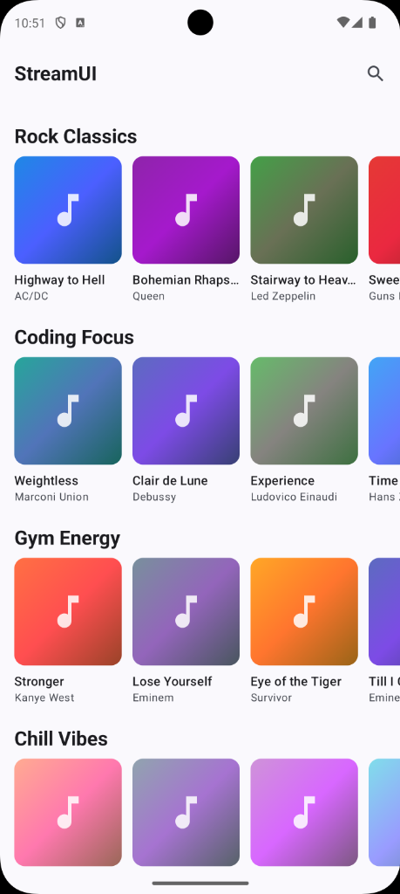
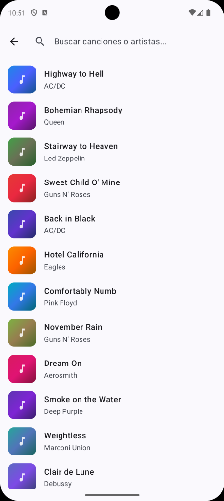

<!-- _class: lead -->
# Module 2: Android Advanced Development
## Architecture, Navigation & Modern UI
### Adrián Catalán
### adriancatalan@galileo.edu

---

# Agenda

1. **Module App**
2. **Advanced UI & Navigation**
3. **MVVM & UDF**
4. **Dependency Injection**
5. **Deep Dive**
6. **Challenge Lab**

---

## 1. StreamUI App

<table align="center" cellpadding="20">
  <tr>
    <td align="center">
      
      <h3>Home</h3>
    </td>
    <td align="center">
      
      <h3>Search</h3>
    </td>
    <td align="center">
      
      <h3>Player</h3>
    </td>
  </tr>
</table>

---

<!-- _class: lead -->
# 2. Advanced UI & Navigation


---

## Type-Safe Navigation

Traditional Android navigation relied on Strings (`"profile/{id}"`). This was fragile:
- Typos caused runtime crashes.
- Arguments were untyped (everything is a String).
- Refactoring was a nightmare (Find & Replace).

Navigation Compose 2.8+ introduces **Type Safety**:
- Define destinations as **Objects** or **Data Classes**.
- Compiler verifies types at build time.
- Arguments are typed (Int, Boolean, Custom Objects).


---

## The Navigation Graph

The `PlayerDestination` screen is reused by both screens (Home & Search).

```text
       [HomeDestination] ──────────────┐
              │                        │
        (search icon)                  │
              │                        ▼
              │              [PlayerDestination]
              ▼                        ▲
      [SearchDestination] ─────────────┘
              │
        (song click)
```


---

## Defining Destinations 

**Key concept:** `@Serializable` allows the library to turn this class into a route automatically.


```kotlin
//ui/navigation/Destinations.kt
// 1. Simple Destination (No args)
@Serializable
data object HomeDestination

// 2. Simple Destination (No args)
@Serializable
data object SearchDestination

// 3. Destination with Arguments
@Serializable
data class PlayerDestination(
    val songId: String // Type-safe argument!
)
```

---

## Under the Hood: Serialization in Navigation

**How does it work?**
`kotlinx.serialization` converts your Objects into a URL format internally.

*   Arguments are mapped to URL parameters.
*   Primitives (Int, Bool) and Strings are supported out-of-the-box.
*   Complex objects can be passed (though IDs are recommended).

**Example Mapping:**
`PlayerDestination(songId = "rock_1")`
⬇️
`android-app://androidx.navigation/com.example.PlayerDestination/rock_1`

---

## The NavHost

```kotlin
//MainActivity.kt:
// Define the Graph using Types
NavHost(navController = navController, startDestination = HomeDestination) {
    
    // Define composable for a specific Type
    composable<HomeDestination> {
        HomeScreen(
            onSongClick = { song ->
                // Compile-time check!
                navController.navigate(PlayerDestination(song.id))
            }
        )
    }

    // Extract arguments safely
    composable<PlayerDestination> { backStackEntry ->
        val dest = backStackEntry.toRoute<PlayerDestination>()
        // destination.songId IS a String. Guaranteed.
        PlayerScreen(songId = dest.songId)
    }
}
```

---

## The Back Stack & Pop Behavior

Navigation Compose manages a "LIFO" (Last-In, First-Out) stack.

**Scenario:**
1.  Home (`Start`)
2.  Navigate to Search (`Push Search`) -> Stack: `[Home, Search]`
3.  Click Song (`Push Player`) -> Stack: `[Home, Search, Player]`
4.  Press Back (`Pop Player`) -> Stack: `[Home, Search]`

**Cyclic Navigation?**
Use `popUpTo` to avoid infinite stacks (e.g., Home -> Search -> Home -> Search...).

---

## Navigation with Tabs 

Tabs allow switching between top-level destinations.

**Components:**
1.  **Scaffold**: Provides the slot for `bottomBar`.
2.  **NavigationBar**: The container for items.
3.  **NavigationBarItem**: Each clickable tab.

**State Management:**
You need to know *which* tab is selected.
`val currentRoute = navController.currentBackStackEntryAsState().value?.destination`

---

## The Graphs Hierarchy

Usually, `BottomNavigation` lives **outside** the child NavHost, or wraps it.

```text
MainActivity
 └── Scaffold
      ├── bottomBar (NavigationBar)
      └── content (NavHost)
            ├── HomeRoute
            └── HighlightsRoute (New!)
```

---

## Resources: Navigation
1.  [**Official Guide: Type Safety in Kotlin DSL**](https://developer.android.com/guide/navigation/design/type-safety)
2.  [**Now in Android: Navigation Compose**](https://github.com/android/nowinandroid/tree/main/feature/search)
3.  [**Kotlin Serialization Setup**](https://kotlinlang.org/docs/serialization.html#setup)
4.  [**Codelab: Navigation in Jetpack Compose**](https://developer.android.com/codelabs/jetpack-compose-navigation)
5.  [**Medium: Migrating to Type-Safe Navigation**](https://medium.com/androiddevelopers/navigation-compose-type-safety-f50f28325041)


---

<!-- _class: lead -->

# 3. MVVM & Basic UDF
## Bringing order to chaos

---

## MVVM & UDF

### Definitions
*   **MVVM (Model-View-ViewModel)**: An architectural pattern that separates the UI (View) from the business logic and data (Model) using a mediator (ViewModel).
*   **UDF (Unidirectional Data Flow)**: A design pattern where state flows down and events flow up. This guarantees consistency and simplifies debugging.

---

## MVVM Components Diagram

```text
    ┌──────────────┐         ┌───────────────┐         ┌──────────────┐
    │  View (UI)   │ ──────> │   ViewModel   │ ──────> │ Model (Data) │
    │              │ <────── │               │ <────── │              │
    └──────────────┘         └───────────────┘         └──────────────┘
      (Events/State)          (Request/Data)
```

---

## What is Clean Architecture?

 

---

## What is Clean Architecture?

A software design philosophy that separates the elements of a design into ring levels.

**Dependency Rule**
Source code dependencies can only point **inwards**.
*   Nothing in an inner circle can know anything at all about something in an outer circle.
*   The Domain (Business Logic) knows nothing about the Database or the UI.


---

## Clean Architecture Layers

**1. Presentation Layer (UI + ViewModel)**
*   Handles user interaction and state display.
*   *Depends on:* Domain (or Data if Domain is skipped).

**2. Domain Layer (Optional)**
*   Pure business logic (Use Cases).
*   *Depends on:* Data (Interface).

**3. Data Layer (Repository + Source)**
*   Handles data retrieval (API, DB).
*   *Depends on:* Nothing (Frameworks).

---

## Project Structure (Clean Architecture)

How we organize code to support MVVM:

```text
app/src/main/java/com/curso/...
├── data/
│   ├── model/         (Immutable Data Classes: Song, Category)
│   └── repository/    (Data Fetching: MockMusicRepository)
├── di/                (Dependency Injection: AppModule)
└── ui/
    ├── navigation/    (Routes: Destinations)
    ├── screens/       (Composables: HomeScreen)
    └── viewmodel/     (State Holders: HomeViewModel)
```

---

## Why MVVM?

Putting all logic in the UI (Activity/Composable) leads to "God Classes" that are impossible to test or maintain.

**What for?**
**MVVM** moves decision-making to a `ViewModel`.
**UDF (Unidirectional Data Flow)** ensures data flows strictly one way:
1.  **Events** flow UP (UI -> ViewModel)
2.  **State** flows DOWN (ViewModel -> UI)

---

## The Restaurant Kitchen (Arch)


**Problem (No Architecture):**
The Waiter (UI) takes the order, goes to the kitchen, cooks the burger, pours the drinks, and calculates the bill.
*   **Result:** Chaos. Waiter is overwhelmed. If the Waiter quits (Screen Rotation), the order is lost.

**Solution (MVVM):**
*   **Waiter (UI):** Only takes orders and serves food. Doesn't know how to cook.
*   **Chef (ViewModel):** Receives the order (Event), cooks using ingredients (Repository), and puts the plate on the counter (State).
*   **Result:** Efficient. Chef keeps cooking even if the Waiter goes on break.

---

## Visualization: UDF Cycle

The UI *never* changes the state directly. It asks the ViewModel to do it.

```text
    ┌─────────────────┐             ┌─────────────────┐
    │       UI        │ <────────── │    ViewModel    │
    │  (HomeScreen)   │    STATE    │ (HomeViewModel) │
    └─────────────────┘             └─────────────────┘
             │                               ^
             │                               │
             │            EVENT              │
             └───────────────────────────────┘
                     (onSongClick)
```

---

## The ViewModel

From `ui/viewmodel/HomeViewModel.kt`:

```kotlin
class HomeViewModel(private val repository: MockMusicRepository) : ViewModel() {

    // 1. State Holder (Private Mutable)
    private val _uiState = MutableStateFlow<HomeUiState>(HomeUiState.Loading)
    
    // 2. Exposed State (Public Immutable)
    val uiState: StateFlow<HomeUiState> = _uiState.asStateFlow()

    init {
        loadData()
    }

    private fun loadData() {
        // ViewModel decides WHEN and HOW state changes
        val data = repository.getCategories()
        _uiState.value = HomeUiState.Success(data)
    }
}
```

---

## The View 

```kotlin
//ui/screens/HomeScreen.kt
@Composable
fun HomeScreen(viewModel: HomeViewModel = koinViewModel()) {
    
    // 1. Observe State (Waiter watches the counter)
    val state by viewModel.uiState.collectAsState()

    // 2. React to State
    when (state) {
        is HomeUiState.Loading -> LoadingView()
        is HomeUiState.Success -> {
            HomeContent(
                songs = (state as HomeUiState.Success).songs,
                // 3. Send Events (Waiter passes order to kitchen)
                onSongClick = { song -> viewModel.onSongSelected(song) }
            )
        }
    }
}
```

---

## Resources: MVVM & UDF
1.  [**Guide to App Architecture**](https://developer.android.com/topic/architecture)
2.  [**State Holder Pattern**](https://developer.android.com/topic/architecture/ui-layer/stateholders)
3.  [**Unidirectional Data Flow in Compose**](https://developer.android.com/develop/ui/compose/architecture#udf)
4.  [**ViewModel Overview**](https://developer.android.com/topic/libraries/architecture/viewmodel)
5.  [**Codelab: State in Jetpack Compose**](https://developer.android.com/codelabs/jetpack-compose-state)

---


<!-- _class: lead -->
# 4. Dependency Injection

---

## Dependency Injection (DI)

**What is it?**
A design pattern where a class receives the objects it depends on (dependencies) from an external source rather than creating them itself.

**Inversion of Control (IoC):**
Instead of the App controlling the creation of dependencies, a Container controls it and provides them when asked.

---

## S.O.L.I.D. Principles

*   **S**ingle Responsibility: One class, one job.
*   **O**pen/Closed: Open for extension, closed for modification.
*   **L**iskov Substitution: Subtypes must be substitutable for base types.
*   **I**nterface Segregation: Many client-specific interfaces are better than one general-purpose interface.
*   **D**ependency Inversion: **Depend on abstractions, not concretions.** (This is the core of DI!).

---

## Manual vs Automated DI

**Manual DI:**
You create a container class by hand that holds references.
*   *Pros:* No libraries, transparent.
*   *Cons:* Boilerplate code, hard to manage scopes.

**Automated DI (Koin/Hilt):**
A library manages the container.
*   *Pros:* Less code, lifecycle awareness, easy testing.
*   *Cons:* Learning curve, "magic" behavior.

---

## Koin

**Why?**
If `HomeViewModel` creates its own `MockMusicRepository`, they are glued together forever. You can't test the ViewModel with fake data, and you assume the Repository is easy to create.

**What for?**
**Dependency Injection (DI)** means asking for what you need instead of creating it. A centralized "Container" (Koin) provides the dependencies.

---

## Real World Analogy

**Problem (No DI):**
Every time you need a car, you personally forge the steel, mold the tires, and refine the gasoline.
*   **Result:** Inefficient. You need to know how to build *everything*.

**Solution (DI):**
You act as an Assembly Line. You say: *"I need an Engine and 4 Wheels."*
*   **Container (Koin):** Provides the Engine and Wheels (maybe from a stockpile, maybe new).
*   **Result:** You just assemble. You don't care where the Engine came from.

---

## Dependency Graph

Both ViewModels share the **same** Repository instance

 

---

## The Module

```kotlin
//di/AppModule.kt
val appModule = module {
    // 1. Define the Singleton (The Stockpile)
    // "Create one MockMusicRepository and keep it forever"
    singleOf(::MockMusicRepository)

    // 2. Define ViewModels (The Consumers)
    // "When someone asks for HomeViewModel, give them one"
    // "Koin automatically finds the Repository it needs"
    viewModelOf(::HomeViewModel)
    viewModelOf(::SearchViewModel)
}
```

---

## Injection point

```kotlin
//MainActivity.kt
// 1. Start Koin (The Turnkey)
startKoin {
    androidContext(this@StreamApplication)
    modules(appModule)
}

// 2. Inject in Composable (The Ask)
@Composable
fun HomeScreen(
    // "Hey Koin, give me the HomeViewModel!"
    viewModel: HomeViewModel = koinViewModel() 
) {
    // ...
}
```

---

## Resources: Dependency Injection (Koin)
1.  [**Koin Official Docs for Android**](https://insert-koin.io/docs/quickstart/android)
2.  [**Koin with Jetpack Compose**](https://insert-koin.io/docs/reference/koin-android/compose)
3.  [**Manual Dependency Injection**](https://developer.android.com/training/dependency-injection/manual)
4.  [**Hilt vs Koin**](https://medium.com/android-news/hilt-vs-koin-dependency-injection-frameworks-for-android-69375543c7b8)
5.  [**Video: DI in a Nutshell**](https://www.youtube.com/watch?v=eH9UrciQqYA)

---


<!-- _class: lead -->
# 5. Deep Dive


---

## Recomposition

**The Core Concept:**
Recomposition is calling your Composable functions again with new data.

**When does it happen?**
When the **inputs** of a Composable change.
*   State variables (`MutableState`)
*   Function parameters

**The Golden Rule:**
Composable functions can run in any order, in parallel, and very frequently. **Keep them Side-Effect Free!**

---

## Stability

Compose needs to know if a type is "Stable" to decide whether to skip it.

**Stable Types:**
*   Primitives & Strings.
*   Classes where all properties are `val` and Stable.
*   Classes marked with `@Immutable` or `@Stable`.

**Unstable Types:**
*   Classes with `var` properties.
*   Lists/Maps from the standard library (use `Kotlinx Immutable Collections` to fix this).

---

## Skippability

If Compose sees that inputs haven't changed, it **Skips** the function.

```kotlin
@Composable
fun SongCard(song: Song) { ... }
```

1.  First composition: `song = Song("A")` -> **Draw**.
2.  Next frame: `song` is still `Song("A")`?
    *   If `Song` is Stable -> **Skip**.
    *   If `Song` is Unstable -> **Recompose** (even if data is same!).

**Lesson:** Use Data Classes with `val` for maximum performance.

---

## Side Effects

Sometimes we need to escape the Composable lifecycle (e.g., Log analytics, Start a timer).

**Side Effects Handlers:**
1.  `LaunchedEffect(key)`: Runs a coroutine when `key` changes.
2.  `DisposableEffect(key)`: Runs cleanup code when the Composable leaves the screen.
3.  `SideEffect`: Runs on every successful recomposition (rare).

**Example:**
```kotlin
LaunchedEffect(Unit) {
    analytics.logScreenView("Home")
}
```

---

## State Management Strategies

**`remember`**:
Saves a value across recompositions.
*   *Lost on:* Configuration change (Rotation).

**`rememberSaveable`**:
Saves a value across recompositions AND configuration changes (via Bundle).
*   *Essential for:* TextFields, check boxes, simple UI state.

**`ViewModel`**:
Saves state across configuration changes and survives until the screen is destroyed.
*   *Essential for:* Business logic, screen data.

---

## Architecture & UDF

**Single Source of Truth (SSOT):**
*   The `ViewModel` is the SSOT for the UI state.
*   The `Repository` is the SSOT for the data.

**State Hoisting:**
*   Moving state up to make a component stateless.
*   *Example:* `SongCard` doesn't know *how* to be a favorite, it just tells `HomeViewModel` (via `HomeScreen`) that it was clicked.

---

## DI Scopes

**Singleton (`single`):**
*   Created once, lives as long as the container (App).
*   *Use for:* Repositories, Retrofit clients, Databases.

**Factory (`factory`):**
*   Created every time it's asked for.
*   *Use for:* Helper classes, heavy objects that shouldn't be kept in memory when not used.

**Scoped (`viewModel`):**
*   Lives as long as the associated Scope (Activity/Fragment/NavGraph).
*   *Use for:* ViewModels.

---

<!-- _class: lead -->
# 6. Challenge Lab
## Practice & Application

---

## Part 1: Song Favorites

**Context:**
Users want to mark songs as favorites. This requires understanding state hoisting and event propagation in MVVM.

**Your Task:**
Implement a favorites system that:
- Adds a heart icon to each `SongCard`
- Toggles favorite status when tapped
- Propagates the event from UI → ViewModel → Repository
- Demonstrates why child Composables shouldn't own state


---

## Part 1: Song Favorites
**Files to Modify:**
- `data/model/Models.kt` (Song data class)
- `ui/components/SongCard.kt`
- `ui/screens/HomeScreen.kt`
- `ui/viewmodel/HomeViewModel.kt`

---

## Part 1: Definition of Done

| Criteria | Description |
|----------|-------------|
| Model updated | `Song` has `isFavorite: Boolean = false` field |
| Heart icon visible | Each SongCard shows heart icon (filled/outlined) |
| Event hoisting | `SongCard` receives `onFavoriteClick: (String) -> Unit` |
| ViewModel handles | `toggleFavorite(id: String)` method in ViewModel |
| State updates | Clicking heart updates the song's favorite status |
| UI reflects change | Heart icon toggles between filled/outlined |
| No state in child | `SongCard` is stateless (receives data, emits events) |

---

## Part 2: Highlights Screen with Bottom Navigation

**Context:**
Create a new screen that shows only favorite songs, accessible via bottom navigation tabs.

**Your Task:**
Implement navigation that:
- Adds a new `HighlightsDestination` route
- Creates `HighlightsScreen` showing only favorites
- Implements bottom navigation with Home and Highlights tabs
- Shares state between screens (favorites sync in real-time)

---

## Part 2: Highlights Screen with Bottom Navigation

**Files to Modify/Create:**
- `ui/navigation/Destinations.kt`
- Create `ui/screens/HighlightsScreen.kt`
- `MainActivity.kt` (add Scaffold with bottomBar)

---

## Part 2: Definition of Done

| Criteria | Description |
|----------|-------------|
| Route exists | `HighlightsDestination` defined in `Destinations.kt` |
| Screen created | `HighlightsScreen.kt` displays filtered favorites |
| Bottom nav visible | `NavigationBar` with 2 `NavigationBarItem` |
| Tab switching works | Tapping tabs navigates between screens |
| Correct Icons | Home icon for Home, Star icon for Highlights |
| State shared | Favoriting on Home reflects on Highlights immediately |
| Current tab highlighted | Active tab visually distinguished |


---
<!-- _class: lead -->
## Recommended Articles

**Architecture & MVVM**
*   [ViewModels: A Simple Example](https://medium.com/androiddevelopers/viewmodels-a-simple-example-ed5ac416317e) - Android Developers
*   [The Clean Architecture: Beginners Guide](https://proandroiddev.com/clean-architecture-in-android-a-beginners-approach-4af32b2f9d0e) - ProAndroidDev
*   [UI State Production in Android](https://medium.com/androiddevelopers/ui-state-production-flow-5fe5fdfe1bc5) - Android Developers

**Navigation Compose**
*   [Navigation Compose Meet Safe Args](https://medium.com/androiddevelopers/navigation-compose-meet-type-safety-e081fb3cf2f8) - Android Developers
*   [Nested Navigation Graphs in Compose](https://proandroiddev.com/nested-navigation-graphs-in-jetpack-compose-2c5bc5c6f27a) - ProAndroidDev
*   [Deep Links in Navigation Compose](https://dev.to/manuelvicnt/deep-links-in-navigation-compose-3hni) - Manuel Vivo

