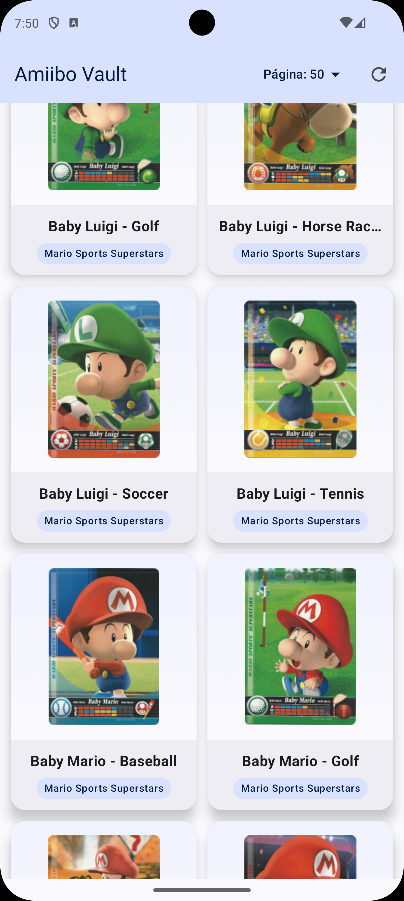

# Amiibo Vault

Una aplicación Android educativa que implementa el patrón **Offline-First** para mostrar una colección de figuras Amiibo.

## Descripción

Amiibo Vault es una aplicación diseñada con fines pedagógicos para demostrar conceptos avanzados de desarrollo Android:

- **MVVM con UiState**: Manejo de estados de carga, éxito y error usando `sealed interfaces`
- **Room Database**: Persistencia local con KSP (Kotlin Symbol Processing)
- **Retrofit + Kotlinx Serialization**: Consumo de API REST y parsing de JSON
- **Coil**: Carga asíncrona de imágenes
- **Koin**: Inyección de dependencias
- **Paginación Infinita**: Carga progresiva de datos con infinite scroll
- **Pull-to-Refresh**: Actualización de datos deslizando hacia abajo
- **Optimizaciones Compose**: Uso de `derivedStateOf` para detección eficiente de scroll

## Cómo se ve el app

| Lista de Amiibos (Home) | Detalle de Amiibo |
|:-----------------------:|:-----------------:|
|  |  |

## Demo Video

Puedes ver una demostración de la app en funcionamiento aquí:
[Ver Demo (WebM)](assets/module3.webm)

## Arquitectura Offline-First

La filosofía central de esta aplicación es: **"La Base de Datos es la única fuente de verdad"**.

```
┌─────────────────────────────────────────────────────────────────────┐
│                                                                     │
│    ┌─────────┐         ┌─────────────┐         ┌─────────────┐    │
│    │   API   │ ──────> │    ROOM     │ ──────> │     UI      │    │
│    │(Retrofit│         │  DATABASE   │         │  (Compose)  │    │
│    └─────────┘         └─────────────┘         └─────────────┘    │
│                              │                        ▲            │
│                              │                        │            │
│                              └── Flow<List<Entity>> ──┘            │
│                                                                     │
│    1. La app SIEMPRE lee datos desde Room (nunca directo de red)   │
│    2. Los datos de red se guardan en Room antes de mostrarse       │
│    3. Room notifica automáticamente a la UI cuando hay cambios     │
│                                                                     │
└─────────────────────────────────────────────────────────────────────┘
```

### Flujo de Datos

1. **Al iniciar la app**: El ViewModel observa el `Flow` de Room
2. **Refresh solicitado**: El Repository llama a la API
3. **Datos recibidos**: Se guardan en Room (reemplazando los existentes)
4. **Room notifica**: El `Flow` emite la nueva lista automáticamente
5. **UI actualizada**: Compose se recompone con los nuevos datos

### Beneficios

- **Experiencia offline**: Los datos persisten entre sesiones
- **Consistencia**: Una sola fuente de verdad para la UI
- **Performance**: Lecturas rápidas desde la base de datos local
- **Simplicidad**: El ViewModel solo observa Room, no maneja múltiples fuentes

## Estructura del Proyecto

```
app/src/main/java/com/curso/android/module3/amiibo/
├── AmiiboApplication.kt          # Inicialización de Koin
├── MainActivity.kt               # Entry point de la UI
├── data/
│   ├── local/
│   │   ├── entity/
│   │   │   └── AmiiboEntity.kt   # Modelo de datos para Room
│   │   ├── dao/
│   │   │   └── AmiiboDao.kt      # Data Access Object (queries)
│   │   └── db/
│   │       └── AmiiboDatabase.kt # Configuración de Room
│   └── remote/
│       ├── api/
│       │   └── AmiiboApiService.kt  # Definición de endpoints
│       └── model/
│           └── AmiiboDto.kt      # DTOs para mapear JSON
├── domain/
│   └── error/
│       └── AmiiboError.kt        # Tipos de errores (sealed class)
├── repository/
│   └── AmiiboRepository.kt       # Patrón Repository
├── di/
│   └── AppModule.kt              # Módulo de Koin
└── ui/
    ├── viewmodel/
    │   └── AmiiboViewModel.kt    # ViewModel con UiState
    ├── screens/
    │   └── AmiiboListScreen.kt   # Pantalla principal (Compose)
    └── theme/
        └── Theme.kt              # Tema Material 3
```

## Tecnologías Utilizadas

| Tecnología | Versión | Propósito |
|------------|---------|-----------|
| Kotlin | 2.0.21 | Lenguaje de programación |
| KSP | 2.0.21-1.0.28 | Procesamiento de símbolos (reemplaza KAPT) |
| Room | 2.7.0 | Base de datos local (SQLite) |
| Retrofit | 2.11.0 | Cliente HTTP |
| Kotlinx Serialization | 1.7.3 | Parsing de JSON |
| Coil | 3.0.4 | Carga de imágenes |
| Koin | 4.0.0 | Inyección de dependencias |
| Jetpack Compose | BOM 2024.12.01 | UI declarativa |
| Material 3 | - | Sistema de diseño |

## API Utilizada

La aplicación consume la [AmiiboAPI](https://www.amiiboapi.com/):

```
GET https://www.amiiboapi.com/api/amiibo/
```

Respuesta:
```json
{
  "amiibo": [
    {
      "head": "00000000",
      "tail": "00000002",
      "name": "Mario",
      "gameSeries": "Super Mario",
      "image": "https://..."
    },
    ...
  ]
}
```

## Conceptos Clave Explicados

### 1. Sealed Interface (UiState)

```kotlin
sealed interface AmiiboUiState {
    data object Loading : AmiiboUiState
    data class Success(val amiibos: List<AmiiboEntity>) : AmiiboUiState
    data class Error(val message: String) : AmiiboUiState
}
```

Garantiza que manejemos **todos** los estados posibles en la UI.

### 2. Room con KSP

KSP (Kotlin Symbol Processing) reemplaza a KAPT:
- Hasta 2x más rápido
- Genera código Kotlin nativo
- La versión de KSP **debe coincidir** con la versión de Kotlin

### 3. Flow Reactivo

```kotlin
// En el DAO
@Query("SELECT * FROM amiibos")
fun getAllAmiibos(): Flow<List<AmiiboEntity>>

// En el ViewModel
val amiibos = repository.observeAmiibos()
    .stateIn(viewModelScope, SharingStarted.WhileSubscribed(5000), emptyList())
```

Room emite automáticamente cuando los datos cambian.

### 4. Koin DI

```kotlin
val appModule = module {
    single { Room.databaseBuilder(...).build() }
    single { get<AmiiboDatabase>().amiiboDao() }
    single { AmiiboRepository(get(), get()) }
    viewModel { AmiiboViewModel(get()) }
}
```

No usa generación de código ni reflexión.

### 5. Tipos de Errores (Sealed Class)

En lugar de propagar excepciones genéricas, usamos una `sealed class` para errores tipados:

```kotlin
sealed class AmiiboError(
    override val message: String,
    override val cause: Throwable? = null
) : Exception(message, cause) {
    class Network(...) : AmiiboError(...)   // Sin conexión
    class Parse(...) : AmiiboError(...)     // JSON inválido
    class Database(...) : AmiiboError(...)  // Error de Room
    class Unknown(...) : AmiiboError(...)   // Otros errores
}
```

**Beneficios:**
- El compilador verifica que manejes todos los casos con `when`
- La UI puede mostrar iconos diferentes por tipo de error
- Se puede decidir si reintentar (Network sí, Parse no)
- Mejor experiencia de usuario con mensajes específicos

### 6. Paginación del Lado del Cliente

La API de Amiibo no soporta paginación del servidor, así que implementamos paginación del lado del cliente:

```
┌─────────────────────────────────────────────────────────────────────┐
│                     PAGINACIÓN CLIENT-SIDE                          │
│                                                                     │
│    ┌─────────┐         ┌─────────────┐         ┌─────────────┐    │
│    │   API   │ ──────> │    ROOM     │ ──────> │     UI      │    │
│    │ (todos) │         │ LIMIT/OFFSET│         │  (páginas)  │    │
│    └─────────┘         └─────────────┘         └─────────────┘    │
│                                                                     │
│    1. API retorna TODOS los amiibos (~900)                         │
│    2. Se guardan todos en Room                                      │
│    3. UI carga por páginas usando LIMIT/OFFSET                     │
│    4. Infinite scroll detecta scroll al final                       │
│                                                                     │
└─────────────────────────────────────────────────────────────────────┘
```

**DAO con LIMIT/OFFSET:**
```kotlin
@Query("SELECT * FROM amiibos ORDER BY name ASC LIMIT :limit OFFSET :offset")
suspend fun getAmiibosPage(limit: Int, offset: Int): List<AmiiboEntity>
```

**Opciones de tamaño de página:** 20, 50, 100 items (configurable por el usuario)

### 7. Pull-to-Refresh (Material 3)

Patrón de UX que permite actualizar contenido deslizando hacia abajo:

```kotlin
PullToRefreshBox(
    isRefreshing = state.isRefreshing,
    onRefresh = { viewModel.refreshAmiibos() }
) {
    // Contenido scrollable
    AmiiboGrid(...)
}
```

**Beneficios sobre un LinearProgressIndicator manual:**
- Animación nativa del sistema (familiar para usuarios)
- Gesture handling automático
- Integración natural con el scroll del contenido

### 8. derivedStateOf - Optimización de Compose

`derivedStateOf` es una optimización clave para valores derivados de otros estados:

```kotlin
// ❌ ANTES: LaunchedEffect se ejecuta en CADA scroll
LaunchedEffect(gridState.firstVisibleItemIndex) {
    val shouldLoad = /* cálculo */
    if (shouldLoad) onLoadMore()
}

// ✅ DESPUÉS: Solo notifica cuando el RESULTADO cambia
val shouldLoadMore by remember {
    derivedStateOf {
        val lastVisible = gridState.layoutInfo.visibleItemsInfo.lastOrNull()?.index ?: 0
        lastVisible >= totalItems - 6 && hasMorePages && !isLoadingMore
    }
}

LaunchedEffect(shouldLoadMore) {
    if (shouldLoadMore) onLoadMore()
}
```

**Cuándo usar cada uno:**
| Técnica | Uso |
|---------|-----|
| `derivedStateOf` | Valores **derivados** de otro estado (ej: "¿debo cargar más?") |
| `LaunchedEffect` | **Efectos secundarios** (llamadas a APIs, navegación) |
| `remember` | Valores que **no cambian** entre recomposiciones |

### 9. Manejo de Errores en Paginación

Los errores al cargar más páginas se manejan de forma diferente al error principal:

```
┌─────────────────────────────────────────────────────────────────────┐
│ Error Principal (sin datos)    │  Error de Paginación (con datos)  │
├────────────────────────────────┼────────────────────────────────────┤
│                                │                                    │
│       ┌───────────────┐        │    ┌─────┐ ┌─────┐ ┌─────┐       │
│       │    ❌ Error   │        │    │ Card│ │ Card│ │ Card│       │
│       │               │        │    └─────┘ └─────┘ └─────┘       │
│       │  [Reintentar] │        │    ┌─────┐ ┌─────┐ ┌─────┐       │
│       └───────────────┘        │    │ Card│ │ Card│ │ Card│       │
│                                │    └─────┘ └─────┘ └─────┘       │
│                                │    ┌─────────────────────────┐    │
│                                │    │ ❌ Error | [Reintentar] │    │
│                                │    └─────────────────────────┘    │
│                                │                                    │
└────────────────────────────────┴────────────────────────────────────┘
```

**Ventajas:**
- Los datos existentes permanecen visibles
- El usuario no pierde su posición de scroll
- El botón "Reintentar" aparece inline al final de la lista

### 10. Configuración de Timeouts

OkHttp está configurado con timeouts de 15 segundos:

```kotlin
OkHttpClient.Builder()
    .connectTimeout(15, TimeUnit.SECONDS)  // Tiempo para conectar
    .readTimeout(15, TimeUnit.SECONDS)     // Tiempo para leer respuesta
    .writeTimeout(15, TimeUnit.SECONDS)    // Tiempo para enviar request
    .build()
```

**¿Por qué 15 segundos?**
- Balance entre espera y UX
- Suficiente para conexiones móviles lentas
- No demasiado largo que frustre al usuario

### 11. Migraciones de Room (fallbackToDestructiveMigration)

En desarrollo usamos `fallbackToDestructiveMigration()` que **BORRA todos los datos** si la versión de la BD cambia:

```kotlin
Room.databaseBuilder(...)
    .fallbackToDestructiveMigration(dropAllTables = true)  // ⚠️ SOLO DESARROLLO
    .build()
```

**En producción** debes usar migraciones manuales:

```kotlin
val MIGRATION_1_2 = object : Migration(1, 2) {
    override fun migrate(db: SupportSQLiteDatabase) {
        db.execSQL("ALTER TABLE amiibos ADD COLUMN favorite INTEGER DEFAULT 0")
    }
}

Room.databaseBuilder(...)
    .addMigrations(MIGRATION_1_2)
    .build()
```

Ver: [Room Migrations Guide](https://developer.android.com/training/data-storage/room/migrating-db-versions)

## Cómo Ejecutar

1. Clonar el repositorio
2. Abrir en Android Studio (Hedgehog o superior)
3. Sincronizar Gradle
4. Ejecutar en emulador o dispositivo (API 24+)

## Requisitos

- Android Studio Hedgehog (2023.1.1) o superior
- JDK 17
- Android SDK 36 (compileSdk)
- Dispositivo/Emulador con API 24+ (minSdk)

## Notas Educativas

### Tests

> **Nota**: Los tests unitarios están fuera del alcance de este módulo educativo. Sin embargo, la arquitectura con inyección de dependencias (Koin) y errores tipados está preparada para facilitar el testing:
> - Los repositorios pueden ser mockeados fácilmente
> - Los tipos de error permiten verificar manejo correcto de cada caso
> - El patrón UiState hace los tests de ViewModel más claros

### Recursos Adicionales

- [Room with Kotlin Flows](https://developer.android.com/topic/libraries/architecture/room)
- [Koin Documentation](https://insert-koin.io/docs/quickstart/kotlin/)
- [Sealed Classes in Kotlin](https://kotlinlang.org/docs/sealed-classes.html)
- [StateFlow and SharedFlow](https://developer.android.com/kotlin/flow/stateflow-and-sharedflow)
- [Pull-to-Refresh (Material 3)](https://developer.android.com/reference/kotlin/androidx/compose/material3/pulltorefresh/package-summary)
- [derivedStateOf en Compose](https://developer.android.com/jetpack/compose/side-effects#derivedstateof)
- [Infinite Scroll/Pagination](https://developer.android.com/topic/libraries/architecture/paging/v3-overview)

## Licencia

Este proyecto es de uso educativo.

---

> Este proyecto ha sido generado usando Claude Code y adaptado con fines educativos por Adrián Catalán.
