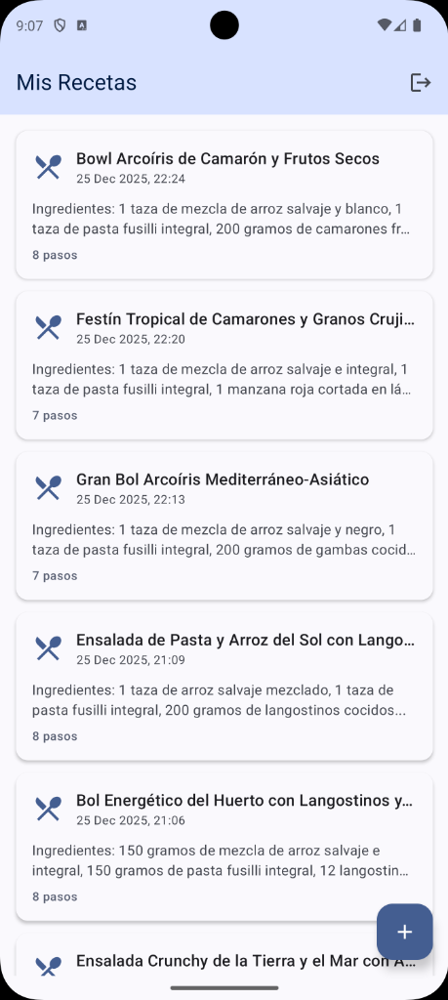
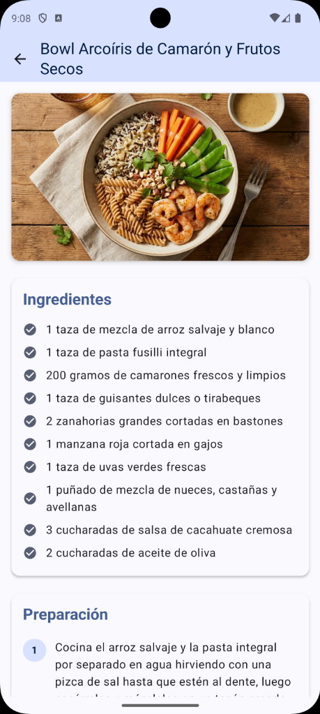

<!-- _class: lead -->
# Module 5: Firebase & AI
## Authentication, Cloud Storage & Gemini
### Adrián Catalán
### adriancatalan@galileo.edu

---

# Agenda

1. **Module App**
2. **Firebase Auth & Firestore**
3. **Firebase Storage & App Check**
4. **Firebase AI Logic & Gemini**
5. **Deep Dive**
6. **Challenge Lab**

---

## AI Chef App

An app that uses **AI to analyze ingredients** from photos and generate recipes.

| Recipe List | Generator | Detail |
|:-----------:|:---------:|:------:|
|  |  |  |

---

## What We're Building

**Features:**
1. **User Auth**: Email/password authentication
2. **Photo Analysis**: Gemini analyzes ingredient images
3. **Recipe Generation**: AI creates recipes from ingredients
4. **Image Generation**: AI creates photorealistic dish images
5. **Cloud Storage**: Cache generated images

**The Challenge:**
Coordinate Auth + Firestore + Storage + AI in a clean architecture.

---

<!-- _class: lead -->
# 2. Firebase Auth & Firestore
## User Authentication & Real-time Database

---

## Firebase Auth: Why?

**The Problem (DIY Auth):**
- Build password hashing, token management, session handling
- Implement email verification, password reset
- Handle security vulnerabilities
- Scale your auth server

**The Solution (Firebase Auth):**
- Pre-built, battle-tested authentication
- Multiple providers (Email, Google, Apple, etc.)
- Automatic token refresh
- Security rules integration

---

## Auth Flow Visualization

```text
┌─────────────────────────────────────────────────────────────────┐
│                        Firebase Auth                            │
├─────────────────────────────────────────────────────────────────┤
│                                                                 │
│  [App]                    [Firebase]              [Backend]     │
│    │                          │                       │         │
│    │ -- signIn(email,pw) ---> │                       │         │
│    │                          │ -- Verify ----------> │         │
│    │                          │ <-- OK -------------- │         │
│    │ <-- ID Token ----------- │                       │         │
│    │                          │                       │         │
│    │     (Token auto-refreshes every hour)            │         │
│    │                          │                       │         │
│    │ -- Request + Token ----> │                       │         │
│    │                          │ -- Validate --------> │         │
│    │ <-- Protected Data ----- │                       │         │
│                                                                 │
└─────────────────────────────────────────────────────────────────┘
```

---

## Live Code: AuthRepository Interface

```kotlin
//data/firebase/IAuthRepository.kt
interface IAuthRepository {
    val currentUserId: String?
    val isLoggedIn: Boolean

    fun observeAuthState(): Flow<AuthState>
    suspend fun signIn(email: String, password: String): Result<String>
    suspend fun signUp(email: String, password: String): Result<String>
    fun signOut()
}

sealed class AuthState {
    data object Loading : AuthState()
    data class Authenticated(val userId: String, val email: String?) : AuthState()
    data object Unauthenticated : AuthState()
}
```

---

## Live Code: AuthRepository Implementation

```kotlin
//data/firebase/AuthRepository.kt
class AuthRepository @Inject constructor() : IAuthRepository {
    private val auth: FirebaseAuth = FirebaseAuth.getInstance()

    override val currentUserId: String?
        get() = auth.currentUser?.uid

    override val isLoggedIn: Boolean
        get() = auth.currentUser != null

    override suspend fun signIn(email: String, password: String): Result<String> {
        return try {
            val result = auth.signInWithEmailAndPassword(email, password).await()
            val userId = result.user?.uid
                ?: return Result.failure(Exception("User not found"))
            Result.success(userId)
        } catch (e: FirebaseAuthInvalidUserException) {
            Result.failure(Exception("User not found"))
        } catch (e: FirebaseAuthInvalidCredentialsException) {
            Result.failure(Exception("Incorrect password"))
        }
    }
}
```

---

## Callback to Flow: AuthStateListener

```kotlin
override fun observeAuthState(): Flow<AuthState> = callbackFlow {
    val authStateListener = FirebaseAuth.AuthStateListener { firebaseAuth ->
        val user = firebaseAuth.currentUser
        val state = if (user != null) {
            AuthState.Authenticated(
                userId = user.uid,
                email = user.email
            )
        } else {
            AuthState.Unauthenticated
        }
        trySend(state)  // Emit to Flow
    }

    auth.addAuthStateListener(authStateListener)

    // Cleanup when Flow is cancelled
    awaitClose {
        auth.removeAuthStateListener(authStateListener)
    }
}
```

---

## Cloud Firestore: Why?

**The Problem (REST API):**
- Polling for updates (inefficient)
- Manual caching logic
- Build your own query system
- No offline support

**The Solution (Firestore):**
- **Real-time listeners**: Data syncs instantly
- **Offline persistence**: Works without internet
- **Structured queries**: Filter, order, paginate
- **Security rules**: Server-side access control

---

## Firestore Data Model

```text
┌─────────────────────────────────────────────────────────────────┐
│                         Firestore                               │
├─────────────────────────────────────────────────────────────────┤
│                                                                 │
│  recipes (Collection)                                           │
│    │                                                            │
│    ├── abc123 (Document)                                        │
│    │     ├── userId: "user_xyz"                                 │
│    │     ├── title: "Pasta Primavera"                           │
│    │     ├── ingredients: ["pasta", "tomatoes", "basil"]        │
│    │     ├── steps: ["Boil water", "Add pasta", ...]           │
│    │     ├── imageUri: "content://..."                          │
│    │     ├── generatedImageUrl: "https://storage..."           │
│    │     └── createdAt: 1703520000000                           │
│    │                                                            │
│    └── def456 (Document)                                        │
│          └── ...                                                │
│                                                                 │
└─────────────────────────────────────────────────────────────────┘
```

---

## Live Code: Recipe Data Model

```kotlin
//domain/model/Recipe.kt
data class Recipe(
    val id: String = "",
    val userId: String = "",
    val title: String = "",
    val ingredients: List<String> = emptyList(),
    val steps: List<String> = emptyList(),
    val imageUri: String = "",
    val generatedImageUrl: String = "",
    val createdAt: Long = System.currentTimeMillis()
) {
    fun toMap(): Map<String, Any> = mapOf(
        "userId" to userId,
        "title" to title,
        "ingredients" to ingredients,
        "steps" to steps,
        "imageUri" to imageUri,
        "generatedImageUrl" to generatedImageUrl,
        "createdAt" to createdAt
    )
}
```

---

## Live Code: FirestoreRepository

```kotlin
//data/firebase/FirestoreRepository.kt
class FirestoreRepository @Inject constructor() : IFirestoreRepository {
    private val firestore = FirebaseFirestore.getInstance()
    private val recipesCollection = firestore.collection("recipes")

    override suspend fun saveRecipe(recipe: Recipe): Result<String> {
        return try {
            val documentRef = recipesCollection.add(recipe.toMap()).await()
            Result.success(documentRef.id)
        } catch (e: Exception) {
            Result.failure(Exception("Error saving: ${e.message}"))
        }
    }

    override suspend fun updateGeneratedImageUrl(
        recipeId: String,
        imageUrl: String
    ): Result<Unit> {
        return try {
            recipesCollection.document(recipeId)
                .update("generatedImageUrl", imageUrl)
                .await()
            Result.success(Unit)
        } catch (e: Exception) {
            Result.failure(e)
        }
    }
}
```

---

## Real-time Sync with Snapshot Listeners

```kotlin
override fun observeUserRecipes(userId: String): Flow<List<Recipe>> = callbackFlow {
    val query = recipesCollection
        .whereEqualTo("userId", userId)
        .orderBy("createdAt", Query.Direction.DESCENDING)

    val listenerRegistration = query.addSnapshotListener { snapshot, error ->
        if (error != null) {
            trySend(emptyList())
            return@addSnapshotListener
        }

        val recipes = snapshot?.documents?.mapNotNull { document ->
            Recipe.fromFirestore(document.id, document.data ?: emptyMap())
        } ?: emptyList()

        trySend(recipes)  // Emit updated list
    }

    awaitClose { listenerRegistration.remove() }
}
```

---

## Firestore Security Rules

```javascript
rules_version = '2';
service cloud.firestore {
  match /databases/{database}/documents {
    match /recipes/{recipeId} {
      // Anyone logged in can read
      allow read: if request.auth != null;

      // Only owner can create (must set own userId)
      allow create: if request.auth != null
                    && request.auth.uid == request.resource.data.userId;

      // Only owner can update/delete
      allow update, delete: if request.auth != null
                            && request.auth.uid == resource.data.userId;
    }
  }
}
```

---

<!-- _class: lead -->
# 3. Firebase Storage & App Check
## File Storage & Security

---

## Firebase Storage: Why?

**The Problem:**
- Store images on device → Lost on uninstall
- Store images in Firestore → Document size limit (1MB)
- Build your own file server → Cost, scaling, CDN

**The Solution (Firebase Storage):**
- Built on Google Cloud Storage
- Automatic CDN distribution
- Resumable uploads
- Security rules integration
- Up to 5GB per file

---

## Storage Architecture

```text
┌─────────────────────────────────────────────────────────────────┐
│                     Firebase Storage                            │
├─────────────────────────────────────────────────────────────────┤
│                                                                 │
│  gs://your-bucket.appspot.com/                                 │
│    │                                                            │
│    └── recipe_images/                                           │
│          ├── abc123.jpg  (Recipe ID as filename)               │
│          ├── def456.jpg                                         │
│          └── ghi789.jpg                                         │
│                                                                 │
│  [App] -- upload(bitmap) --> [Storage] -- returns --> [URL]    │
│                                                                 │
│  Download URL: https://firebasestorage.googleapis.com/...      │
│                                                                 │
└─────────────────────────────────────────────────────────────────┘
```

---

## Live Code: StorageRepository

```kotlin
//data/firebase/StorageRepository.kt
class StorageRepository @Inject constructor() : IStorageRepository {
    private val storage = Firebase.storage
    private val recipeImagesRef = storage.reference.child("recipe_images")

    override suspend fun uploadRecipeImage(
        recipeId: String,
        bitmap: Bitmap
    ): Result<String> {
        return try {
            val imageRef = recipeImagesRef.child("$recipeId.jpg")

            // Compress Bitmap to JPEG
            val baos = ByteArrayOutputStream()
            bitmap.compress(Bitmap.CompressFormat.JPEG, 85, baos)
            val imageData = baos.toByteArray()

            // Upload bytes
            imageRef.putBytes(imageData).await()

            // Get download URL
            val downloadUrl = imageRef.downloadUrl.await().toString()
            Result.success(downloadUrl)
        } catch (e: Exception) {
            Result.failure(e)
        }
    }
}
```

---

## Cache-First Strategy

```kotlin
override suspend fun imageExists(recipeId: String): Boolean {
    return try {
        val imageRef = recipeImagesRef.child("$recipeId.jpg")
        imageRef.metadata.await()  // Throws if not exists
        true
    } catch (e: Exception) {
        false
    }
}

override suspend fun getImageUrl(recipeId: String): String? {
    return try {
        val imageRef = recipeImagesRef.child("$recipeId.jpg")
        imageRef.downloadUrl.await().toString()
    } catch (e: Exception) {
        null
    }
}
```

**Why cache?** AI image generation is expensive. Generate once, reuse forever.

---

## Storage Security Rules

```javascript
rules_version = '2';
service firebase.storage {
  match /b/{bucket}/o {
    match /recipe_images/{imageId} {
      // Anyone logged in can read
      allow read: if request.auth != null;

      // Write with restrictions
      allow write: if request.auth != null
                   // Max 5MB
                   && request.resource.size < 5 * 1024 * 1024
                   // Only images
                   && request.resource.contentType.matches('image/.*');
    }
  }
}
```

---

## App Check: Why?

**The Problem:**
- Anyone can call your Firebase APIs with your API key
- API keys are visible in APK (easy to extract)
- Bots and scrapers abuse your backend
- You pay for fraudulent requests

**The Solution (App Check):**
- Verifies requests come from YOUR app
- Uses device attestation (Play Integrity, DeviceCheck)
- Blocks requests from modified apps, emulators, scripts
- **Required for Firebase AI Logic**

---

## App Check Flow

```text
┌─────────────────────────────────────────────────────────────────┐
│                        App Check Flow                           │
├─────────────────────────────────────────────────────────────────┤
│                                                                 │
│  [Your App]              [Play Integrity]        [Firebase]     │
│      │                         │                      │         │
│      │ -- Get attestation ---> │                      │         │
│      │ <-- Device token ---    │                      │         │
│      │                         │                      │         │
│      │ -- Exchange token -----------------------> │         │
│      │ <-- App Check token ------------------- │         │
│      │                                                │         │
│      │ -- API Request + App Check token --------> │         │
│      │                                                │         │
│      │    (Firebase validates token before processing)         │
│      │                                                │         │
│      │ <-- Response ------------------------------- │         │
│                                                                 │
└─────────────────────────────────────────────────────────────────┘
```

---

## App Check Setup

```kotlin
//AiChefApplication.kt
@HiltAndroidApp
class AiChefApplication : Application() {

    override fun onCreate() {
        super.onCreate()

        // Initialize Firebase
        Firebase.initialize(this)

        // ===== CRITICAL FOR FIREBASE AI LOGIC =====
        // Firebase AI Logic REQUIRES App Check enabled
        Firebase.appCheck.installAppCheckProviderFactory(
            // DEBUG: Use debug provider (generates debug token)
            DebugAppCheckProviderFactory.getInstance()

            // PRODUCTION: Use Play Integrity
            // PlayIntegrityAppCheckProviderFactory.getInstance()
        )
    }
}
```

---

## Debug Token Registration

**Step 1:** Run app in debug mode

**Step 2:** Find token in Logcat
```
D/DebugAppCheckProvider: Enter this debug token in Firebase Console:
   xxxxxxxx-xxxx-xxxx-xxxx-xxxxxxxxxxxx
```

**Step 3:** Register in Firebase Console
```
Firebase Console → Build → App Check → Apps →
Your App → Manage debug tokens → Add debug token
```

**Step 4:** Wait ~5 minutes for propagation

---

<!-- _class: lead -->
# 4. Firebase AI Logic & Gemini
## Multimodal AI in Your App

---

## Firebase AI Logic: What Is It?

**The Evolution:**
1. `com.google.ai.client.generativeai` → Direct Gemini API (deprecated)
2. `firebase-vertexai` → Vertex AI backend (deprecated)
3. **`firebase-ai`** → Firebase AI Logic (current, 2025+)

**Why Firebase AI Logic?**
- Unified with Firebase ecosystem
- App Check integration (prevents abuse)
- Automatic token management
- Access to latest Gemini models

---

## Multimodal AI Explained

**Traditional AI:** Text in → Text out
**Multimodal AI:** Text + Images + Audio → Text + Images

```text
┌─────────────────────────────────────────────────────────────────┐
│                     Gemini Multimodal                           │
├─────────────────────────────────────────────────────────────────┤
│                                                                 │
│  INPUT                              OUTPUT                      │
│  ┌─────────────┐                   ┌─────────────┐             │
│  │ Text        │                   │ Text        │             │
│  │ "Analyze    │                   │ "This is    │             │
│  │  this..."   │                   │  pasta..."  │             │
│  └─────────────┘                   └─────────────┘             │
│  ┌─────────────┐    ┌─────────┐    ┌─────────────┐             │
│  │ Image       │ -> │ Gemini  │ -> │ Image       │             │
│  │ (Bitmap)    │    │         │    │ (Bitmap)    │             │
│  └─────────────┘    └─────────┘    └─────────────┘             │
│                                                                 │
└─────────────────────────────────────────────────────────────────┘
```

---

## Two Models, Two Purposes

```kotlin
//data/remote/AiLogicDataSource.kt

// MODEL 1: Recipe Analysis (Text output from Image input)
private val generativeModel = Firebase.ai(
    backend = GenerativeBackend.googleAI()
).generativeModel("gemini-3-flash-preview")

// MODEL 2: Image Generation (Image output from Text input)
private val imageModel = Firebase.ai(
    backend = GenerativeBackend.googleAI()
).generativeModel(
    modelName = "gemini-3-pro-image-preview",
    generationConfig = generationConfig {
        // Tell Gemini we want images back
        responseModalities = listOf(
            ResponseModality.TEXT,
            ResponseModality.IMAGE
        )
    }
)
```

---

## Live Code: Recipe from Image

```kotlin
override suspend fun generateRecipeFromImage(imageBitmap: Bitmap): GeneratedRecipe {
    val prompt = content {
        image(imageBitmap)  // Multimodal: Add image
        text("""
            Analyze this image of ingredients and generate a recipe.

            Respond EXACTLY in this format:

            TÍTULO: [creative recipe name]

            INGREDIENTES:
            - [ingredient 1 with quantity]
            - [ingredient 2 with quantity]

            PASOS:
            1. [first step]
            2. [second step]
        """.trimIndent())
    }

    val response = generativeModel.generateContent(prompt)
    val responseText = response.text ?: throw Exception("Empty response")

    return parseRecipeResponse(responseText)
}
```

---

## Parsing AI Response

```kotlin
private fun parseRecipeResponse(response: String): GeneratedRecipe {
    // Extract title
    val titleRegex = Regex("""TÍTULO:\s*(.+)""", RegexOption.IGNORE_CASE)
    val title = titleRegex.find(response)?.groupValues?.get(1)?.trim()
        ?: "Mystery Recipe"

    // Extract ingredients section
    val ingredientsSection = response
        .substringAfter("INGREDIENTES:", "")
        .substringBefore("PASOS:", "")

    val ingredients = ingredientsSection
        .lines()
        .filter { it.trim().startsWith("-") }
        .map { it.removePrefix("-").trim() }
        .filter { it.isNotBlank() }

    // Extract steps section
    val stepsSection = response.substringAfter("PASOS:", "")

    val steps = stepsSection
        .lines()
        .filter { it.trim().firstOrNull()?.isDigit() == true }
        .map { it.replace(Regex("""^\d+\.\s*"""), "").trim() }

    return GeneratedRecipe(title, ingredients, steps)
}
```

---

## Live Code: Image Generation

```kotlin
override suspend fun generateRecipeImage(
    recipeTitle: String,
    ingredients: List<String>
): Bitmap {
    val ingredientsList = ingredients.take(5).joinToString(", ")

    val prompt = content {
        text("""
            Generate a professional food photography image:

            Dish: $recipeTitle
            Ingredients: $ingredientsList

            Requirements:
            - Photorealistic, appetizing
            - Beautiful plating
            - Warm lighting
            - Restaurant-quality presentation
        """.trimIndent())
    }

    val response = imageModel.generateContent(prompt)

    // Extract Bitmap from response
    return response.candidates
        .firstOrNull()?.content?.parts
        ?.filterIsInstance<ImagePart>()
        ?.firstOrNull()?.image
        ?: throw Exception("No image generated")
}
```

---

## Response Structure

```text
┌─────────────────────────────────────────────────────────────────┐
│                   GenerateContentResponse                       │
├─────────────────────────────────────────────────────────────────┤
│                                                                 │
│  candidates: List<Candidate>                                    │
│    └── [0]: Candidate                                           │
│          └── content: Content                                   │
│                └── parts: List<Part>                            │
│                      ├── [0]: TextPart("Here's your dish...")  │
│                      └── [1]: ImagePart(bitmap: Bitmap)        │
│                                                                 │
│  // Extract image:                                              │
│  response.candidates[0].content.parts                           │
│      .filterIsInstance<ImagePart>()                            │
│      .first().image  // Bitmap                                  │
│                                                                 │
└─────────────────────────────────────────────────────────────────┘
```

---

## ViewModel: Putting It Together

```kotlin
//ui/viewmodel/ChefViewModel.kt
fun generateRecipe(imageBitmap: Bitmap) {
    viewModelScope.launch {
        try {
            _generationState.value = UiState.Loading("Analyzing...")

            // 1. AI analyzes image
            val recipe = aiLogicDataSource.generateRecipeFromImage(imageBitmap)

            // 2. Save to Firestore
            val result = firestoreRepository.saveRecipe(
                Recipe(
                    userId = authRepository.currentUserId!!,
                    title = recipe.title,
                    ingredients = recipe.ingredients,
                    steps = recipe.steps
                )
            )

            result.fold(
                onSuccess = { id -> _generationState.value = UiState.Success(id) },
                onFailure = { e -> _generationState.value = UiState.Error(e.message) }
            )
        } catch (e: Exception) {
            _generationState.value = UiState.Error(e.message)
        }
    }
}
```

---

## Image Caching Flow

```kotlin
fun generateRecipeImage(
    recipeId: String,
    existingImageUrl: String,  // From Firestore
    recipeTitle: String,
    ingredients: List<String>
) {
    viewModelScope.launch {
        // 1. Check cache first
        if (existingImageUrl.isNotBlank()) {
            _imageState.value = UiState.Success(existingImageUrl)
            return@launch
        }

        // 2. Generate with AI
        _imageState.value = UiState.Loading("Generating image...")
        val bitmap = aiLogicDataSource.generateRecipeImage(recipeTitle, ingredients)

        // 3. Upload to Storage
        val url = storageRepository.uploadRecipeImage(recipeId, bitmap)

        // 4. Save URL to Firestore (cache)
        firestoreRepository.updateGeneratedImageUrl(recipeId, url)

        _imageState.value = UiState.Success(url)
    }
}
```

---

<!-- _class: lead -->
# 5. Deep Dive
## Under the Hood

---

## 1. callbackFlow: Bridging Callbacks to Coroutines

```kotlin
fun observeAuthState(): Flow<AuthState> = callbackFlow {
    // 1. Create callback
    val listener = FirebaseAuth.AuthStateListener { auth ->
        trySend(mapToState(auth.currentUser))  // Emit to Flow
    }

    // 2. Register callback
    auth.addAuthStateListener(listener)

    // 3. CRITICAL: Cleanup when Flow is cancelled
    awaitClose {
        auth.removeAuthStateListener(listener)
    }
}
```

**Key Rules:**
- Use `trySend()` (non-blocking) not `send()` (suspending)
- Always call `awaitClose {}` to prevent memory leaks
- The block inside `awaitClose` runs when collector cancels

---

## 2. flatMapLatest: Switching Flows

```kotlin
val recipes: StateFlow<List<Recipe>> = authState
    .flatMapLatest { state ->
        when (state) {
            is AuthState.Authenticated ->
                firestoreRepository.observeUserRecipes(state.userId)
            else -> flowOf(emptyList())
        }
    }
    .stateIn(viewModelScope, ...)
```

**What happens:**
1. User logs in → `authState` emits `Authenticated`
2. `flatMapLatest` cancels previous Flow (if any)
3. Starts new Flow for user's recipes
4. User logs out → cancels recipes Flow, emits empty list

---

## 3. Firestore Composite Index

**Error you might see:**
```
FAILED_PRECONDITION: The query requires an index.
You can create it here: https://console.firebase.google.com/...
```

**Why?**
Firestore can only use ONE index per query. Queries with multiple fields need a **composite index**.

```kotlin
// This query needs: userId (ASC) + createdAt (DESC)
recipesCollection
    .whereEqualTo("userId", userId)
    .orderBy("createdAt", Query.Direction.DESCENDING)
```

**Solution:** Click the link in the error to auto-create the index.

---

## 4. App Check Token Flow

```text
[App Start]
     │
     ▼
[DebugAppCheckProviderFactory]
     │
     ├── Generates debug token (UUID)
     │
     ├── Logs to Logcat: "Enter this token..."
     │
     └── Firebase validates token on each request
           │
           ├── Token valid → Request proceeds
           │
           └── Token invalid → 403 Forbidden
```

**Production:**
Replace `DebugAppCheckProviderFactory` with `PlayIntegrityAppCheckProviderFactory`.
This uses hardware attestation (SafetyNet successor).

---

## 5. Hilt Dependency Graph

```text
┌─────────────────────────────────────────────────────────────────┐
│                    Hilt Dependency Graph                        │
├─────────────────────────────────────────────────────────────────┤
│                                                                 │
│  @HiltAndroidApp                                                │
│  AiChefApplication                                              │
│         │                                                       │
│         ▼                                                       │
│  @Module @InstallIn(SingletonComponent)                         │
│  AppModule                                                      │
│         │                                                       │
│         ├── @Binds IAuthRepository ← AuthRepository             │
│         ├── @Binds IFirestoreRepository ← FirestoreRepository   │
│         ├── @Binds IStorageRepository ← StorageRepository       │
│         └── @Binds IAiLogicDataSource ← AiLogicDataSource       │
│                    │                                            │
│                    ▼                                            │
│         @HiltViewModel                                          │
│         ChefViewModel @Inject constructor(...)                  │
│                                                                 │
└─────────────────────────────────────────────────────────────────┘
```

---

<!-- _class: lead -->
# 6. Challenge Lab
## Practice & Application

---

## Part 1: Recipe Favorites

**Context:**
Users can save recipes but have no way to mark their favorites. We need a favorites system with filtering capability.

**Your Task:**
Implement a favorites feature that:
- Adds a heart icon to each recipe card
- Toggles favorite status on tap (updates Firestore)
- Provides a filtered view showing only favorites
- Persists across sessions (stored in Firestore)

**Files to Modify:**
- `domain/model/Recipe.kt`
- `data/firebase/FirestoreRepository.kt`
- `ui/viewmodel/ChefViewModel.kt`
- `ui/screens/RecipeListScreen.kt` (or equivalent)

---

## Part 1: Definition of Done

| Criteria | Description |
|----------|-------------|
| Model updated | `Recipe` has `isFavorite: Boolean` field |
| Firestore sync | `toggleFavorite()` updates document in Firestore |
| Heart icon visible | Each recipe card shows filled/outlined heart |
| Toggle works | Tapping heart updates state and syncs to cloud |
| Filter exists | User can switch to "Favorites only" view |
| Real-time updates | Changes reflect immediately (Firestore listener) |
| Optimistic UI | Heart toggles instantly, reverts on error |

---

## Part 2: Recipe Sharing

**Context:**
Users want to share their AI-generated recipes with friends via social media or messaging apps.

**Your Task:**
Implement recipe sharing that:
- Captures the recipe detail view as an image
- Includes the AI-generated dish photo and recipe info
- Uses Android's native share sheet
- Works with any app that accepts images

**Files to Modify:**
- `ui/screens/RecipeDetailScreen.kt`
- Create `util/ShareUtils.kt`
- `AndroidManifest.xml` (FileProvider if needed)

---

## Part 2: Definition of Done

| Criteria | Description |
|----------|-------------|
| Share button exists | FAB or menu item triggers sharing |
| Composable captured | Recipe card rendered as Bitmap |
| Image includes content | Generated image + title + ingredients visible |
| Share sheet opens | Android's native app chooser appears |
| Multiple apps work | Can share to WhatsApp, Telegram, Email, etc. |
| File cleanup | Temporary files deleted after sharing |
| Loading state | Shows progress while preparing share image |

---

<!-- _class: lead -->
# Resources & Wrap-up

---

## Resources

**Firebase Auth**
*   [Firebase Auth Documentation](https://firebase.google.com/docs/auth)
*   [Auth with Email/Password](https://firebase.google.com/docs/auth/android/password-auth)
*   [Auth State Listener](https://firebase.google.com/docs/auth/android/manage-users)
*   [Custom Auth Claims](https://firebase.google.com/docs/auth/admin/custom-claims)
*   [Codelab: Firebase Auth](https://firebase.google.com/codelabs/firebase-android)

**Cloud Firestore**
*   [Firestore Documentation](https://firebase.google.com/docs/firestore)
*   [Security Rules](https://firebase.google.com/docs/firestore/security/get-started)
*   [Realtime Listeners](https://firebase.google.com/docs/firestore/query-data/listen)
*   [Offline Persistence](https://firebase.google.com/docs/firestore/manage-data/enable-offline)
*   [Composite Indexes](https://firebase.google.com/docs/firestore/query-data/indexing)

**Firebase Storage & App Check**
*   [Storage Documentation](https://firebase.google.com/docs/storage)
*   [Storage Security Rules](https://firebase.google.com/docs/storage/security)
*   [App Check Overview](https://firebase.google.com/docs/app-check)
*   [Debug Provider Setup](https://firebase.google.com/docs/app-check/android/debug-provider)
*   [Play Integrity Integration](https://firebase.google.com/docs/app-check/android/play-integrity-provider)

**Firebase AI Logic (Gemini)**
*   [Firebase AI Logic Overview](https://firebase.google.com/docs/ai-logic)
*   [Gemini API Quickstart](https://ai.google.dev/gemini-api/docs/quickstart)
*   [Multimodal Prompting](https://ai.google.dev/gemini-api/docs/vision)
*   [Image Generation with Gemini](https://ai.google.dev/gemini-api/docs/imagen)
*   [Prompt Engineering Guide](https://ai.google.dev/gemini-api/docs/prompting-intro)

---

## Recommended Articles

**Firebase Auth & Firestore**
*   [Firebase Auth Best Practices](https://medium.com/firebase-developers/firebase-auth-best-practices-92e8c3c4c3b0) - Firebase Developers
*   [Firestore Data Modeling](https://medium.com/firebase-developers/the-key-to-firebase-data-modeling-is-the-use-case-5c0f1ac7fde0) - Firebase Developers
*   [Offline-First with Firestore](https://proandroiddev.com/offline-first-apps-with-cloud-firestore-8b4e0d01bc68) - ProAndroidDev

**Generative AI in Android**
*   [Integrating Gemini in Android Apps](https://medium.com/androiddevelopers/integrating-gemini-in-android-apps-5a93a9a0f7c2) - Android Developers
*   [Multimodal AI: Vision + Text](https://proandroiddev.com/multimodal-ai-in-android-vision-and-text-a0c0f5f1e7a2) - ProAndroidDev
*   [Prompt Engineering for Developers](https://www.deeplearning.ai/short-courses/chatgpt-prompt-engineering-for-developers/) - DeepLearning.AI (Free Course)
